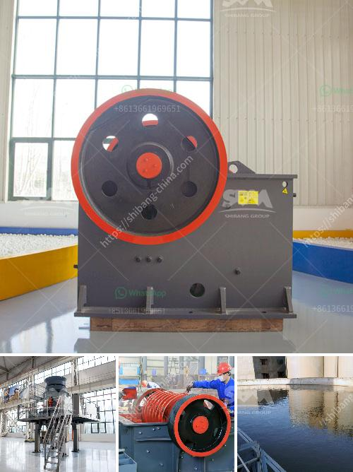

<h3>industrial vibrating feeders</h3>
Industrial vibrating feeders are essential components in the production process of various industries. They are used to convey bulk materials from one place to another in a controlled fashion, ensuring a steady flow of materials to other processing equipment.

Vibrating feeders operate by vibrating the materials along a trough or tube. The vibration creates a high-speed motion that helps to move the materials forward continuously. This controlled movement allows for precise feeding rates, preventing material clogs and spills. The feeders can handle a wide range of materials, including powders, granules, and even heavy-duty materials such as ores and coal.

One of the primary advantages of vibrating feeders is their ability to handle both delicate and abrasive materials. The controlled motion and gentle vibration prevent damage to fragile materials, ensuring their integrity throughout the conveying process. At the same time, the rugged construction of these feeders allows them to handle highly abrasive materials without wearing out quickly.

Another advantage of vibrating feeders is their flexibility in customization. They can be designed to meet specific requirements, such as the desired feed rate, material size, and even environmental conditions. The trough or tube can be made from various materials, including stainless steel, mild steel, and even plastic, depending on the material being conveyed and the surrounding environment. Additionally, the amplitude and frequency of the vibration can be adjusted to match the specific needs of the material and process.

In addition to their versatility, vibrating feeders offer significant cost savings to industries. Their efficient and controlled feeding mechanisms prevent material wastage and spills, minimizing the loss of valuable resources. Moreover, their low maintenance requirements and durable construction contribute to their long lifespan, reducing the need for frequent replacements and repairs. Overall, these factors make vibrating feeders a cost-effective solution for industries seeking a reliable and efficient material handling system.

Industrial vibrating feeders find applications in a wide range of industries. They are commonly used in mining and aggregates, where they can handle large volumes of materials efficiently. In the food and pharmaceutical industries, they ensure the precise feeding of ingredients in the production process. Vibrating feeders are also utilized in chemical and plastics industries to transport materials to reactors and other processing equipment.

To conclude, industrial vibrating feeders play a crucial role in the material handling process across various industries. Their ability to provide controlled and efficient feeding of bulk materials makes them an indispensable part of any production line. With their flexible customization options, cost savings, and wide range of applications, vibrating feeders prove to be reliable and efficient solutions for industries seeking to optimize their processes.
<h3>Contact us</h3><ul><li><strong>Whatsapp:&nbsp;<a href="https://wa.me/8613661969651">+8613661969651</a></strong></li><li><a href="https://swt.shibang-china.com/?git&amp;zhl&amp;industrial vibrating feeders"><strong>Online Service(chat now)</strong></a></li></ul><h3>Related</h3><ul><li><a href='mobile crushers for hire in philippines.md'>mobile crushers for hire in philippines</a></li><li><a href='alluvial gold washing plant in zimbabwe.md'>alluvial gold washing plant in zimbabwe</a></li><li><a href='capital requirement for one ton cement mill.md'>capital requirement for one ton cement mill</a></li><li><a href='costruire une machine pour broyer des briques.md'>costruire une machine pour broyer des briques</a></li><li><a href='raymond mill bentonite.md'>raymond mill bentonite</a></li></ul>