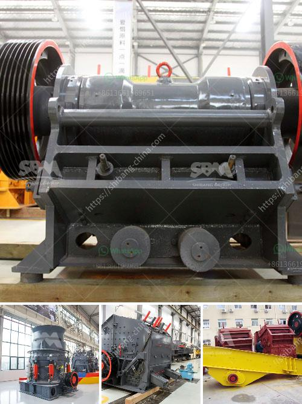

<h3>industrial vibrating screens</h3>
Industrial vibrating screens are an essential component in the production process of numerous industries. They are used for separating and sorting various materials based on their size and shape. These vibrating screens are designed with precision to ensure optimal efficiency and reliability in industrial operations.

One of the key advantages of industrial vibrating screens is their ability to handle a large volume of materials. They can process heavy and abrasive materials without compromising on performance. This makes them a suitable choice for industries such as mining, construction, and recycling.

The design of industrial vibrating screens ensures that the material being fed onto the screen is evenly distributed. This helps to prevent any blockages or jams that could affect the overall efficiency of the screening process. The screens are also equipped with adjustable settings, allowing operators to alter the amplitude and frequency to achieve the desired results.

Another important feature of industrial vibrating screens is their durability and ruggedness. They are designed to withstand harsh operating conditions, including high temperatures, heavy vibrations, and corrosive materials. This ensures that the screens can continue to perform effectively in demanding industrial environments.

Industrial vibrating screens are available in various configurations, including wire mesh, perforated plates, and wedge wire screens. Each configuration offers specific advantages depending on the type of material being screened and the desired end product. Additionally, these screens can be customized to meet the specific requirements of different industries.

In conclusion, industrial vibrating screens play a critical role in the efficient production of various industries. Their ability to handle large volumes of materials, evenly distribute material on the screen, and withstand harsh operating conditions make them an indispensable component in many industrial processes. From mining to recycling, these screens effectively separate and sort materials, contributing to the overall productivity and profitability of industrial operations.
<h3>Contact us</h3><ul><li><strong>Whatsapp:&nbsp;<a href="https://wa.me/8613661969651">+8613661969651</a></strong></li><li><a href="https://swt.shibang-china.com/?git&amp;zhl&amp;industrial vibrating screens"><strong>Online Service(chat now)</strong></a></li></ul><h3>Related</h3><ul><li><a href='crushed stone sorting machinery.md'>crushed stone sorting machinery</a></li><li><a href='quartz making machine germany.md'>quartz making machine germany</a></li><li><a href='granite crushers manufacturers.md'>granite crushers manufacturers</a></li><li><a href='kenya stone crusher.md'>kenya stone crusher</a></li><li><a href='different ore beneficiation equipment all over the world.md'>different ore beneficiation equipment all over the world</a></li></ul>