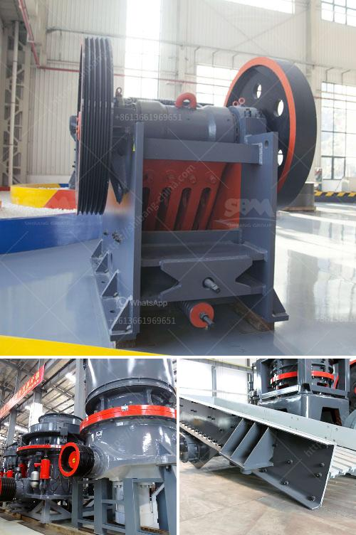

<h3>iron crushing equipment for sale</h3>
Iron is one of the most widely used metals in various industries, such as construction, manufacturing, and automotive. To extract iron from its ores, extensive crushing is required. Iron crushing equipment plays a crucial role in this process by reducing the size of large chunks into smaller pieces, making them more manageable for further processing. If you are in the market for iron crushing equipment, here is a comprehensive guide to help you choose the right equipment for your needs.

When searching for iron crushing equipment, it is essential to consider several factors. Firstly, assess the type of iron you will be crushing. Different types of iron ores require different crushing techniques and equipment. Whether it is magnetite, hematite, or taconite, understanding the characteristics of the material will help you determine the suitable equipment.

Furthermore, evaluating the required capacity is crucial. The capacity of the iron crushing equipment refers to the maximum amount of material it can process in a given time. Consider the volume of iron you need to crush daily or weekly to find equipment that can handle the workload efficiently.

Another vital consideration is the power source and energy requirements of the equipment. While some crushing equipment is powered by electricity, others may rely on diesel engines or hydraulic systems. Determine the most suitable power source based on the available resources and operational preferences.

Moreover, the durability and maintenance requirements of the equipment should not be overlooked. Look for equipment made from high-quality materials that can withstand the rigors of continuous use. Additionally, analyze the maintenance needs and ensure that you have the necessary resources to keep it running smoothly.

Finally, consider the cost. Compare different suppliers and manufacturers to find reasonably priced equipment without compromising on quality. Long-term costs, such as maintenance and replacement parts, should also factor into your decision.

In conclusion, understanding the specific requirements of your iron crushing project is crucial when purchasing crushing equipment. By considering factors like the type of iron, required capacity, power source, durability, and cost, you can make an informed decision. Invest in reliable and efficient iron crushing equipment to ensure smooth operations and maximize productivity in your industry.
<h3>Contact us</h3><ul><li><strong>Whatsapp:&nbsp;<a href="https://wa.me/8613661969651">+8613661969651</a></strong></li><li><a href="https://swt.shibang-china.com/?git&amp;zhl&amp;iron crushing equipment for sale"><strong>Online Service(chat now)</strong></a></li></ul><h3>Related</h3><ul><li><a href='granite processing machinery.md'>granite processing machinery</a></li><li><a href='providers conveyor belts in mexico.md'>providers conveyor belts in mexico</a></li><li><a href='2 micron limestone grinding unit in india.md'>2 micron limestone grinding unit in india</a></li><li><a href='hammer mill lima price.md'>hammer mill lima price</a></li><li><a href='basalt impact crusher price.md'>basalt impact crusher price</a></li></ul>