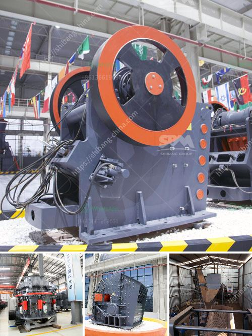

<h3>iron crushing equipment</h3>
Iron crushing equipment is a widely-used and popular machine in industries such as mining, metallurgy, building materials, chemical industry, and highways. The purpose of crushing iron ore material is to reduce its size and make it suitable for industrial use.

There are several different types of crushing equipment, including jaw crusher, hammer crusher, cone crusher, and impact crusher. Each type of crusher has its own unique features and advantages, so it is important to choose the right equipment for your needs.

Jaw crusher is a heavy-duty machine that crushes hard materials by compressing and bending them. It is often used as primary crushing equipment for coarse crushing of iron ore. Hammer crusher is a cost-effective and flexible option for intermediate and fine crushing of iron ore materials. It is commonly used in coal and cement industries.

Cone crusher, as the name suggests, is commonly used for crushing iron ore materials with high hardness. It is suitable for medium and fine crushing of iron ore particles. Impact crusher is mainly used for crushing various types of bulky materials into uniform particles. It is often used in recycling and mining applications.

When choosing iron crushing equipment, it is important to consider factors such as production capacity, power consumption, and equipment durability. Additionally, the size and hardness of the iron ore material should also be taken into account.

In conclusion, iron crushing equipment plays a crucial role in the iron ore processing industry. The various types of crushing machines not only simplify the process but also contribute to the efficient extraction of valuable resources. Whether it is jaw crusher, hammer crusher, cone crusher, or impact crusher, selecting the right equipment is essential for optimizing productivity and ensuring long-term reliability.
<h3>Contact us</h3><ul><li><strong>Whatsapp:&nbsp;<a href="https://wa.me/8613661969651">+8613661969651</a></strong></li><li><a href="https://swt.shibang-china.com/?git&amp;zhl&amp;iron crushing equipment"><strong>Online Service(chat now)</strong></a></li></ul><h3>Related</h3><ul><li><a href='netherlands impact crushers.md'>netherlands impact crushers</a></li><li><a href='gold mining equipment for sale in uganda.md'>gold mining equipment for sale in uganda</a></li><li><a href='how much is the mobile mill for small scale mining.md'>how much is the mobile mill for small scale mining</a></li><li><a href='how to design surge bin hopper crusher.md'>how to design surge bin hopper crusher</a></li><li><a href='stone crushers nigeria.md'>stone crushers nigeria</a></li></ul>