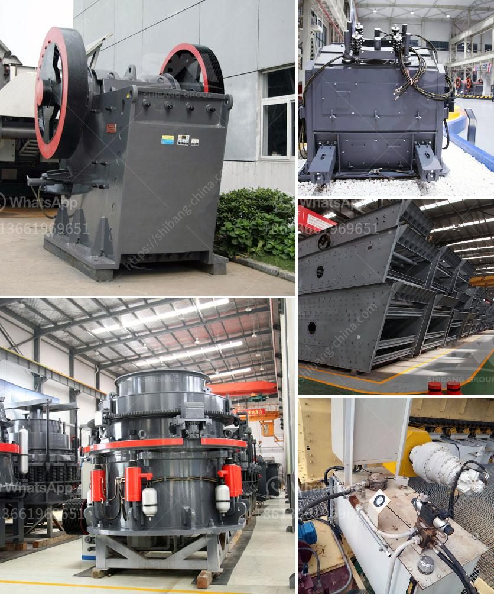

<h3>iron crushing machine cost</h3>
In the mining industry, iron is an essential component used in the production of steel and other metal alloys. To obtain iron, it is necessary to extract it from the earth through a process known as mining. However, before iron can be utilized, it needs to be crushed into smaller pieces to facilitate its transportation and further processing. This is where an iron crushing machine comes into play. In this article, we will explore the cost of iron crushing machines, their benefits, as well as some factors to consider when investing in one.

1. Increased Efficiency: Iron crushing machines are designed to quickly and efficiently crush large pieces of iron ore into smaller particles. This allows for a smoother and more streamlined mining process, reducing time and energy consumption.

2. Cost Reduction: By using iron crushing machines, mining companies can improve their bottom line by reducing the cost of transporting and processing the iron ore. With smaller particles, transportation becomes more efficient, resulting in reduced freight charges. Additionally, smaller particles are easier to handle in subsequent processing stages, further reducing costs.

3. Improved Safety: Iron crushing machines are specifically designed to handle heavy loads, ensuring safe and reliable operation. With enhanced safety features and advanced technology, operators can confidently operate these machines without compromising their well-being or the integrity of the equipment.

1. Initial Investment: The cost of an iron crushing machine can vary greatly depending on its size, capacity, and capabilities. The larger the machine, the higher the initial investment required. It is essential to assess your specific needs and budget to determine the most suitable option within your financial capabilities.

2. Maintenance and Operational Costs: Apart from the initial investment, it is crucial to consider the long-term costs associated with operating and maintaining the iron crushing machine. Routine maintenance, spare parts, and energy consumption all contribute to the overall cost of owning the machine. Researching the availability and cost of spare parts, as well as the machine's energy efficiency, can help in assessing potential operational costs.

3. Production Capacity: Assessing your required production capacity is vital in determining the appropriate iron crushing machine cost. Machines with higher capacities typically come at a higher price. Understanding your production needs and growth expectations will ensure that you select a machine that can adequately meet your requirements without overpaying for unnecessary capacity.

Investing in an iron crushing machine can greatly benefit mining companies by increasing efficiency, reducing costs, and improving overall safety. However, it is essential to carefully consider various factors before making a purchase to ensure that the chosen machine aligns with your specific production needs and budget. By evaluating the initial investment, maintenance and operational costs, as well as the desired production capacity, you can make an informed decision when choosing an iron crushing machine. Ultimately, selecting the right machine will result in long-term cost savings and improved mining operations.
<h3>Contact us</h3><ul><li><strong>Whatsapp:&nbsp;<a href="https://wa.me/8613661969651">+8613661969651</a></strong></li><li><a href="https://swt.shibang-china.com/?git&amp;zhl&amp;iron crushing machine cost"><strong>Online Service(chat now)</strong></a></li></ul><h3>Related</h3><ul><li><a href='mobile crusher medium manufacturers japan.md'>mobile crusher medium manufacturers japan</a></li><li><a href='200 500 tph bauxite mining and processing plant.md'>200 500 tph bauxite mining and processing plant</a></li><li><a href='puzzolana 200 tph cone crushers parts.md'>puzzolana 200 tph cone crushers parts</a></li><li><a href='stone crusher price 20x20 stone.md'>stone crusher price 20x20 stone</a></li><li><a href='counting sensors for conveyor belts.md'>counting sensors for conveyor belts</a></li></ul>