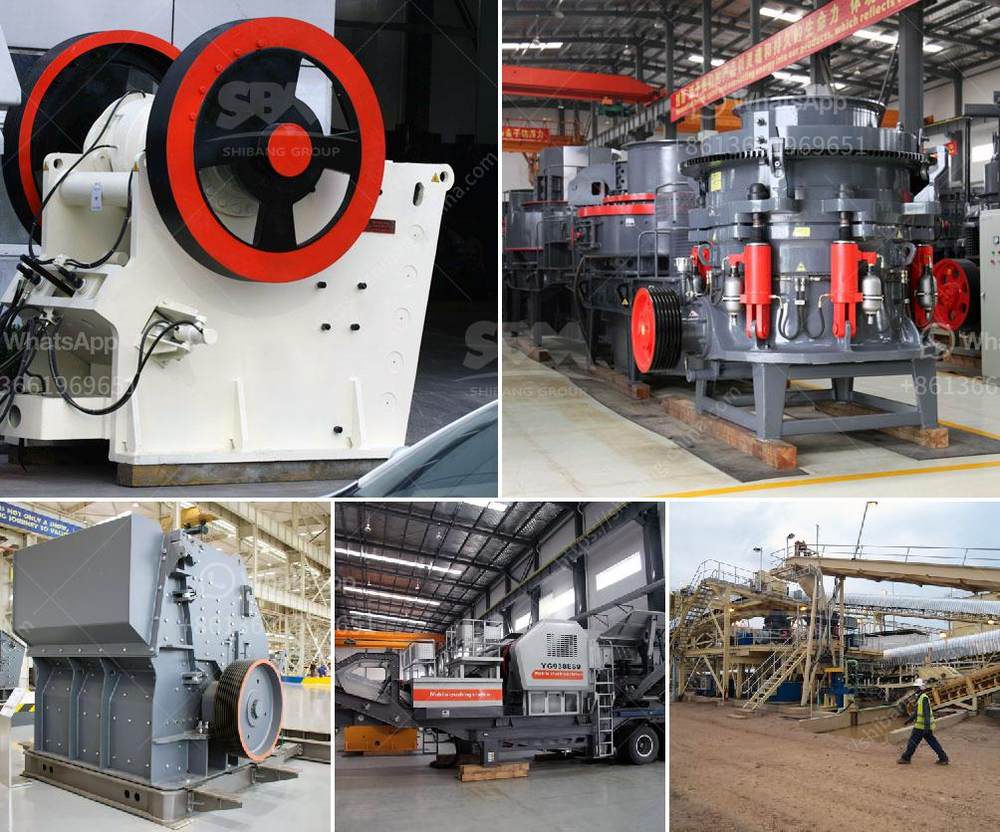

<h3>iron crushing machine in mexico</h3>
Mexico is one of the world's largest producers of iron ore, copper, lead, and zinc, and it has a thriving mining industry. Mexico plays host to the world's leading manufacturers of iron ore crushing equipment and offers highly advanced iron ore crushing machine in Mexico.

Mexico is the largest exporter of iron ore in Latin America, but global conditions are ever-changing. Countries like China and India are becoming increasingly competitive in the market, leading to a decrease in Mexican exports. However, Mexico's mining industry is still thriving, and companies like FTM Machinery are actively producing iron ore crushing machines in Mexico.

Crushing equipment is an essential part of mining operations since it can break down large pieces of rock or ore into more manageable forms for further processing like downstream crushing and grinding. Crushing machinery specifically designed for iron ore processing is an essential part of the mining industry today.

Mexico has rich mineral resources such as iron ore, copper, gold, silver, lead, and zinc, among others. It is one of the world's leading producers of these minerals. However, Mexico's iron ore production has been decreasing over the years due to low market prices and the decline of global demand.

To revive the Mexican iron ore industry, companies such as FTM Machinery, a global leader in mining machinery, have partnered with Mexican companies to import superior crushing equipment that can efficiently process iron ore with high volume outputs. FTM Machinery's impact crusher is particularly suitable for crushing iron ore, limestone, and gypsum, which can crush brittle materials with less than 500mm side length and compressive strength of less than 350 MPa.

FTM Machinery has contributed greatly to Mexico's mining industry. Through this partnership, Mexican mining companies can now access high-quality, reliable, and efficient crushing machines that can handle various tasks such as crushing iron ore, limestone, and gypsum, making it easier for industry players to process minerals in a cost-effective manner.

Moreover, FTM Machinery's crushing equipment is ideal for large-scale crushing operations due to its low maintenance requirements, reliable performance, and high efficiency. The Mexican mining industry can utilize FTM Machinery's crushing machines, which include jaw crushers, cone crushers, and mobile crushers, to improve production efficiency.

Mexico's mining industry is experiencing a period of decline, but there is hope on the horizon as various companies, including FTM Machinery from China, contribute to revitalizing the industry through the production of advanced crushing machines. By importing and utilizing high-quality crushing equipment, the Mexican mining industry can efficiently process minerals and boost production. With continuous technological advancements, Mexico has the potential to regain its position as a leading exporter in the global mining market.
<h3>Contact us</h3><ul><li><strong>Whatsapp:&nbsp;<a href="https://wa.me/8613661969651">+8613661969651</a></strong></li><li><a href="https://swt.shibang-china.com/?git&amp;zhl&amp;iron crushing machine in mexico"><strong>Online Service(chat now)</strong></a></li></ul><h3>Related</h3><ul><li><a href='size of a 50 tpd rotary kiln.md'>size of a 50 tpd rotary kiln</a></li><li><a href='used portable gravel screens for sale.md'>used portable gravel screens for sale</a></li><li><a href='rock crusher for sale in botswana.md'>rock crusher for sale in botswana</a></li><li><a href='iron crushing equipment.md'>iron crushing equipment</a></li><li><a href='used coal washing plants for sale in pakistan.md'>used coal washing plants for sale in pakistan</a></li></ul>