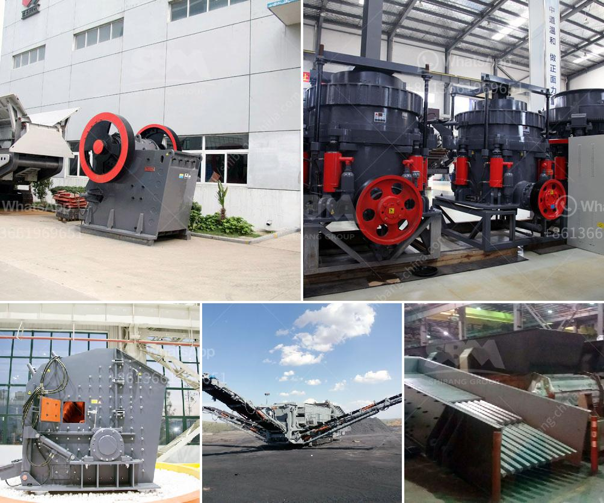

<h3>iron crushing plant for sale</h3>
Are you in the mining industry and looking for a reliable crushing plant for your iron ore project? If so, you are in the right place. In this article, we will explore the iron crushing plant for sale, its benefits, and important considerations when choosing the right crusher for your operations.

Iron ore is one of the essential raw materials in the production of steel, used extensively in infrastructure development and manufacturing. To obtain iron ore, efficient crushing is needed to break down the large rocks into smaller, more manageable sizes. This is where iron crushing plants come into play.

Iron crushing plants are designed to reduce the size of large rocks into smaller pieces and ultimately, generate a powdery form of iron ore suitable for smelting and steel production. These plants typically include various crushing machines, such as jaw crushers, impact crushers, cone crushers, and roller crushers, as well as vibrating screens, conveyors, and feeders.

When choosing an iron crushing plant, there are several key factors to consider. Firstly, the plant's capacity is crucial as it determines the amount of iron ore that can be processed within a certain timeframe. Depending on the scale of your project, you may need a plant with a larger capacity.

Secondly, the efficiency and performance of the crushing machines are essential. Look for crushing plants that offer high crushing ratios, reliable operation, and low maintenance requirements. High-quality crushing machines will ensure that the iron ore is effectively crushed without causing excessive wear and tear or requiring significant downtime for repairs.

Another important consideration is the plant's adaptability to different types of iron ore. As ores can vary in their chemical composition and hardness, it is crucial to choose a crushing plant that can handle a wide range of feed materials. This adaptability will ensure optimal performance and maximize productivity in various mining scenarios.

Additionally, environmental considerations are becoming increasingly important in the mining industry. Look for crushing plants that incorporate environmentally friendly features, such as dust suppression systems and noise reduction technologies. These features promote sustainability and comply with relevant regulations, benefiting both your operations and the surrounding environment.

Now, let's talk about the benefits of purchasing an iron crushing plant. Firstly, having a dedicated crushing plant allows for efficient and continuous ore processing, ensuring a steady supply of iron ore for your operations. This promotes smoother production processes and avoids supply chain disruptions.

Furthermore, investing in a crushing plant can result in significant cost savings in the long run. By having an on-site plant, you eliminate the need for transporting large quantities of raw ore to off-site processing facilities, reducing transportation costs and associated risks.

In conclusion, if you are involved in the mining industry and require reliable and efficient iron ore crushing, exploring the options for an iron crushing plant for sale is a wise decision. Consider capacity, efficiency, adaptability, and environmental features to ensure optimal performance and maximum return on investment. With the right crushing plant, you can streamline your operations, minimize costs, and achieve your production goals successfully.
<h3>Contact us</h3><ul><li><strong>Whatsapp:&nbsp;<a href="https://wa.me/8613661969651">+8613661969651</a></strong></li><li><a href="https://swt.shibang-china.com/?git&amp;zhl&amp;iron crushing plant for sale"><strong>Online Service(chat now)</strong></a></li></ul><h3>Related</h3><ul><li><a href='portable vibrating coal screen.md'>portable vibrating coal screen</a></li><li><a href='recycling of construction materials.md'>recycling of construction materials</a></li><li><a href='stone grinding mills in pakistan.md'>stone grinding mills in pakistan</a></li><li><a href='limestone primary crushing plant.md'>limestone primary crushing plant</a></li><li><a href='ball mill suppliers.md'>ball mill suppliers</a></li></ul>