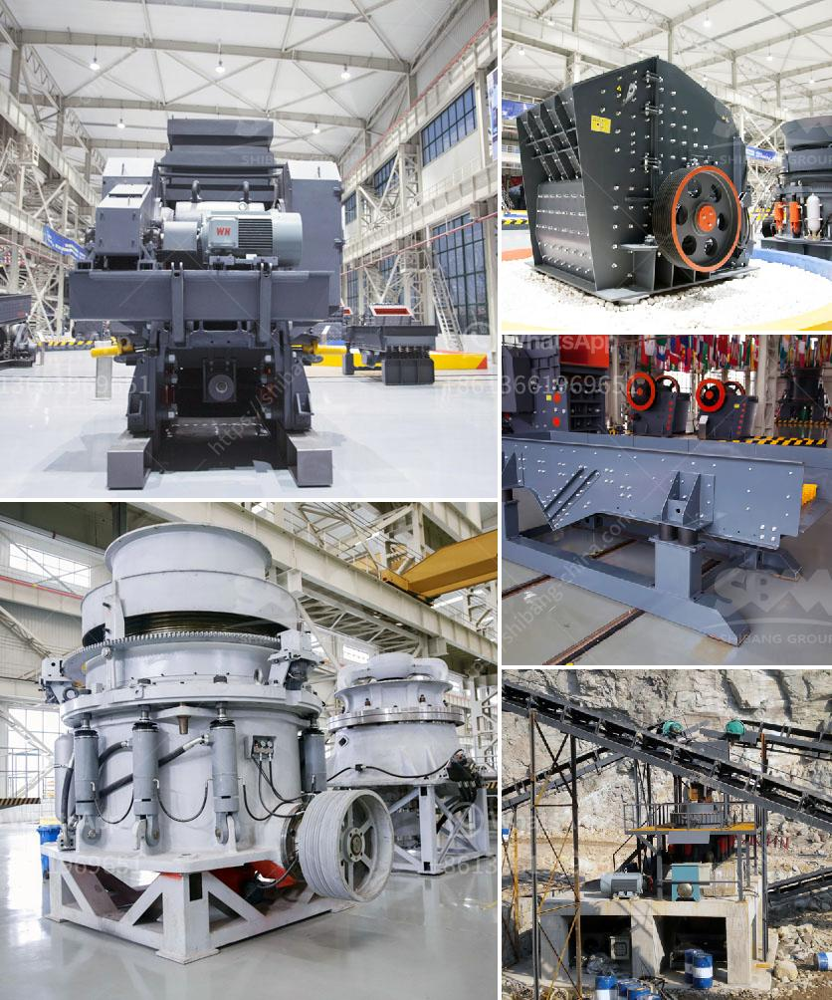

<h3>iron ore beneficiation flowsheet</h3>
Iron ore beneficiation is the process of purifying raw iron ore before smelting it. If this process isn't completed, then the impurities found in the ore, such as silicon, sulfur, and phosphorus, can cause the iron to be brittle and difficult to work with. As a result, iron producers have come up with various methods to extract and purify iron ore, ensuring a high-quality product.

One common method of beneficiation is gravity separation. This process works by separating the valuable iron ore particles from the waste rock and other minerals through the force of gravity. The crushed iron ore is fed into a dense media separation circuit, where the heavy iron particles sink to the bottom while lighter waste materials float to the top. This allows for the separation of the iron ore from the waste, making it easier to extract and process.

Another method of beneficiation is magnetic separation. In this process, magnetic separators are used to separate magnetic materials from non-magnetic ones. The crushed iron ore is passed over magnetic rollers, which attract the magnetic particles while the non-magnetic particles continue to flow. This leads to the separation of the iron ore from other impurities, improving its quality.

In addition to gravity and magnetic separation, chemical processes can also be employed in iron ore beneficiation. One such method is flotation, which is commonly used for the separation of fine-grained ore particles. In flotation, chemicals known as collectors are added to the crushed ore, which cause the valuable particles to cling to air bubbles. These air bubbles then rise to the surface, where they can be skimmed off, leaving behind the unwanted waste materials.

The specific flowsheet for iron ore beneficiation can vary depending on the type of ore being treated and the desired end product. However, most beneficiation processes involve three main stages: crushing, grinding, and separation. Once the ore is crushed and ground, it is then passed over various screens and classifiers to separate the particles according to size. The finer particles are often agglomerated using binders to form pellets or briquettes, which are then fed into the appropriate separation equipment.

In recent years, advancements in technology have allowed for more efficient and environmentally friendly iron ore beneficiation processes. For example, newer magnetic separators are designed to generate high magnetic field strengths with low energy consumption, reducing the environmental impact. Additionally, developments in crushing and grinding equipment have improved the overall efficiency of the process, resulting in higher yields and reduced energy consumption.

Overall, the beneficiation flowsheet of iron ore plays a crucial role in ensuring the viability and sustainability of the iron industry. By removing impurities and improving the quality of the ore, these processes allow for the production of iron that is both economically viable and environmentally friendly. As the demand for iron continues to grow, advancements in beneficiation technology will play a crucial role in meeting this demand while minimizing the industry's environmental footprint.
<h3>Contact us</h3><ul><li><strong>Whatsapp:&nbsp;<a href="https://wa.me/8613661969651">+8613661969651</a></strong></li><li><a href="https://swt.shibang-china.com/?git&amp;zhl&amp;iron ore beneficiation flowsheet"><strong>Online Service(chat now)</strong></a></li></ul><h3>Related</h3><ul><li><a href='disintegrator grinder pulverizer.md'>disintegrator grinder pulverizer</a></li><li><a href='cement clinker processing machine.md'>cement clinker processing machine</a></li><li><a href='flow diagram by gypsum process.md'>flow diagram by gypsum process</a></li><li><a href='puzzolana 200 tph cone crushers parts.md'>puzzolana 200 tph cone crushers parts</a></li><li><a href='cost of set up mini cement plant in india.md'>cost of set up mini cement plant in india</a></li></ul>