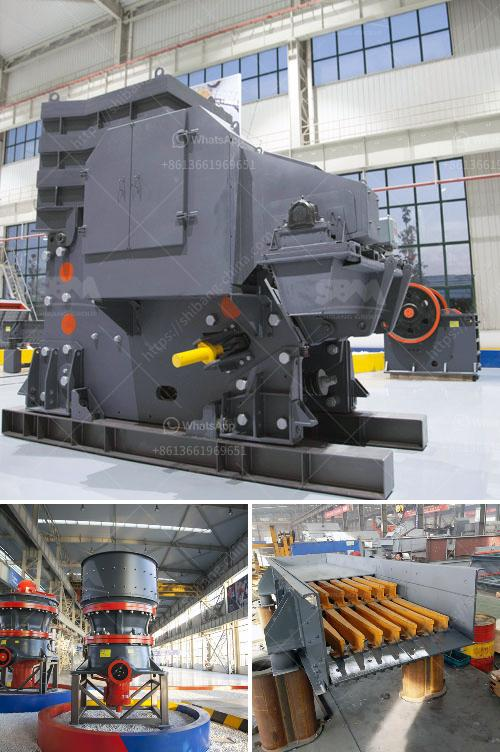

<h3>iron ore concentrate prices</h3>
Iron ore is a crucial raw material for the manufacturing industry, particularly the steel sector. As demand for steel continues to rise globally, the prices of iron ore concentrate have been a topic of great interest for market players.

Iron ore concentrate is a higher-grade product of iron ore that has gone through a beneficiation process and is ready for smelting. This concentrated form of iron ore typically has an iron content of around 60-70%, compared to the 30-50% content found in raw iron ore.

In recent years, the prices of iron ore concentrate have witnessed significant fluctuations, driven primarily by changes in global supply and demand dynamics. China, as the world's largest steel producer, plays a crucial role in influencing iron ore prices. Changes in Chinese government policies, such as environmental regulations and steel production restrictions, can have a major impact on iron ore prices.

Moreover, the COVID-19 pandemic has disrupted the global economy and steel demand, causing fluctuations in iron ore prices. Lockdowns and restrictions led to a decrease in steel production and, subsequently, reduced demand for iron ore concentrate. However, as economies recover and construction and infrastructure projects resume, the demand for iron ore is expected to rise again.

Another factor impacting iron ore concentrate prices is transport costs. Iron ore is mined in various locations worldwide, and transportation costs can vary depending on the proximity of the mine to the market. Additionally, geopolitical tensions, weather conditions, and other logistical challenges can impact the availability and cost of iron ore concentrate.

Overall, the prices of iron ore concentrate are influenced by a range of factors, including global steel demand, Chinese policies, pandemic-related disruptions, logistics, and transportation costs. Market participants closely monitor these factors to anticipate price movements and make informed decisions.

As economies continue to recover from the pandemic and infrastructure projects pick up pace, the demand for iron ore concentrate is expected to increase. However, uncertainties related to the ongoing pandemic and geopolitical tensions may continue to cause price fluctuations in the near future.
<h3>Contact us</h3><ul><li><strong>Whatsapp:&nbsp;<a href="https://wa.me/8613661969651">+8613661969651</a></strong></li><li><a href="https://swt.shibang-china.com/?git&amp;zhl&amp;iron ore concentrate prices"><strong>Online Service(chat now)</strong></a></li></ul><h3>Related</h3><ul><li><a href='price of grinding machine.md'>price of grinding machine</a></li><li><a href='jaw plate for jaw crusher breaker.md'>jaw plate for jaw crusher breaker</a></li><li><a href='industr gold mining equipment and prices.md'>industr gold mining equipment and prices</a></li><li><a href='ball mill made in usa.md'>ball mill made in usa</a></li><li><a href='iron ore mining and beneficiation project.md'>iron ore mining and beneficiation project</a></li></ul>