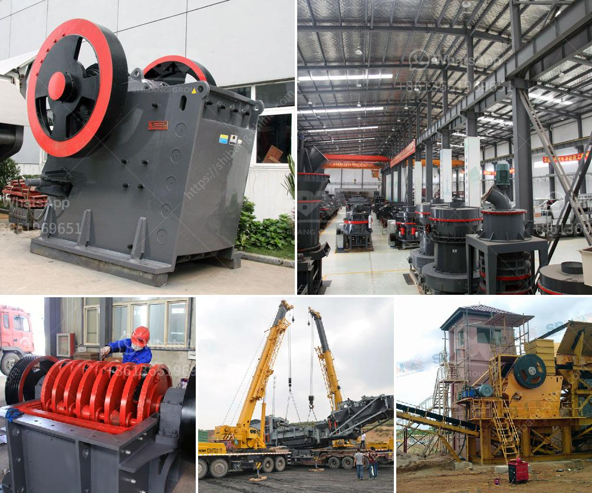

<h3>iron ore conveyor systems cost</h3>
Iron ore, an essential raw material for the steel industry, is found in abundance in nature. Iron ore is transferred to the steelmaking plants via conveyor systems for further processing, beneficiation, and refinement. This process requires the heavy-duty usage of conveyor belts and can significantly contribute to the overall cost of iron ore extraction and transportation. In this article, we will delve into the various aspects of iron ore conveyor systems cost.

First and foremost, the initial investment cost of installing a conveyor system must be considered. The cost of procuring the necessary equipment, including conveyor belts, rollers, motors, and control systems, can be quite substantial. Additionally, there are costs associated with site preparation, installation, and commissioning, which should be factored into the budget.

The length and complexity of the conveyor system play a vital role in determining the overall cost. Longer conveyor systems require more equipment, such as additional belts, rollers, and support structures. More complex systems, including multiple transfer points and diversion gates, also add to the overall cost. The terrain and topography of the transportation route can further increase the cost, as it may necessitate the use of specialized equipment and additional engineering design.

Maintenance and operation costs are another crucial aspect to consider when evaluating the total expenditure of an iron ore conveyor system. Regular inspections, cleaning, and lubrication are essential to ensure the system's smooth operation and prevent breakdowns. The cost of spare parts, repairs, and replacements should be integrated into the financial calculations. Moreover, energy consumption is a significant ongoing cost, particularly for long-distance conveyors, where significant power is required to move the heavy quantities of iron ore.

Efficiency and productivity are also significant factors that influence the cost of iron ore conveyor systems. The speed at which the conveyor moves the ore, the capacity of the system, and the level of automation determine the overall efficiency and productivity. A faster and higher-capacity conveyor can transport more ore in a shorter time, reducing the number of conveyor systems required and potentially lowering costs. However, it is crucial to strike a balance between speed and efficiency to ensure operational reliability and prevent material spillages or jams that can further increase costs.

The lifespan of the equipment is another essential consideration when analyzing the cost of a conveyor system. High-quality components and regular maintenance can extend the lifespan, reducing the need for frequent replacements and minimizing the long-term cost. However, wear and tear are inevitable due to the harsh conditions and continuous operation. As a result, a comprehensive maintenance plan that includes scheduled inspections, part replacements, and repairs is crucial to maximize the lifespan and control expenses.

Lastly, technological advancements and innovative solutions can impact the cost of iron ore conveyor systems. New materials, such as synthetic belts that are more durable and long-lasting, may increase the initial investment but reduce the maintenance and replacement costs over time. Similarly, automation and digitalization of the conveyor systems can improve operational efficiency, reduce labor costs, and minimize downtime.

In conclusion, the cost of iron ore conveyor systems encompasses various factors, including the initial investment, maintenance and operation, efficiency, lifespan, and technological advancements. Each of these aspects should be carefully evaluated and optimized to ensure a cost-effective and reliable transportation process for iron ore. By balancing these considerations, the steel industry can efficiently extract, process, and transport iron ore, ultimately contributing to the production of high-quality steel.
<h3>Contact us</h3><ul><li><strong>Whatsapp:&nbsp;<a href="https://wa.me/8613661969651">+8613661969651</a></strong></li><li><a href="https://swt.shibang-china.com/?git&amp;zhl&amp;iron ore conveyor systems cost"><strong>Online Service(chat now)</strong></a></li></ul><h3>Related</h3><ul><li><a href='mining process of limestone.md'>mining process of limestone</a></li><li><a href='mini cement plant in pakistan.md'>mini cement plant in pakistan</a></li><li><a href='machinery used in cement factory.md'>machinery used in cement factory</a></li><li><a href='high capacity high quality cone crusher to rent.md'>high capacity high quality cone crusher to rent</a></li><li><a href='copper processing plant.md'>copper processing plant</a></li></ul>