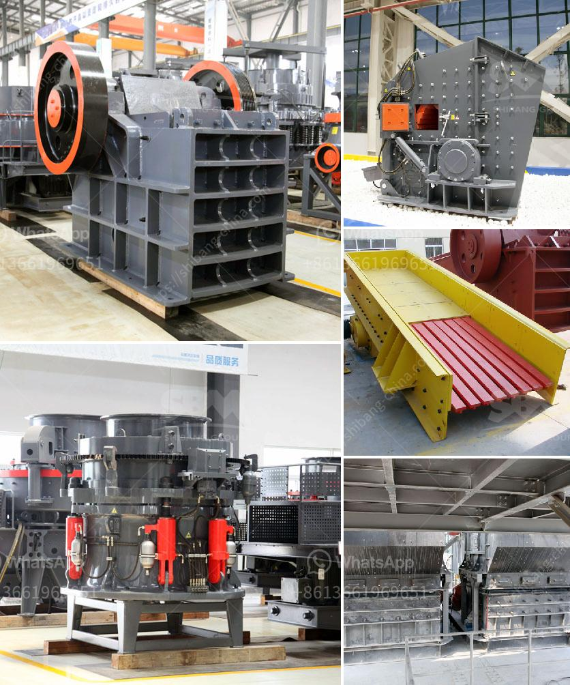

<h3>iron ore crushers</h3>
Iron ore is the key raw material for steel production enterprises. Generally, iron ore with a grade of less than 50% needs to be processed before smelting and utilization. After crushing, grinding, magnetic separation, flotation, and gravity separation, etc., iron is gradually selected from the natural iron ore.

Crushing is the first process that uses the principle of "more crushing and less grinding". Iron ore crushers mainly include jaw crusher, cone crusher, impact crusher, mobile crusher for crushing iron ore. Jaw crusher is usually used for primary crushing; cone crusher is used for secondary and tertiary crushing. Through primary crushing and then by secondary and tertiary crushing, ore will be crushed to the suitable size for feeding ball mill.

Iron ore will be evenly conveyed by vibrating feeder to jaw crusher for primary crushing, the crushed material will be conveyed by belt conveyor to cone crusher for further crushing, material after being crushed will be conveyed to vibrating screen for screening, and reached the required size will be conveyed by belt conveyor to the stockpile; oversized material will return to cone crusher for re-crushing, the final product size can be combined and graded according to the user's needs.

Iron ore is an important raw material in steel production enterprises. After iron is extracted from the ore, it needs to be crushed and ground before it can be smelted and utilized. The crushing process of iron ore includes coarse crushing, medium crushing, and fine crushing. Among them, the coarse crushing usually uses jaw crusher, and the medium and fine crushing uses cone crusher or impact crusher, and the material can be crushed to less than 5mm.

The crusher is widely used in iron ore processing equipment because of its advantages such as simple structure, reliable work, small size, easy to control the work of the crusher and other advantages. The crusher can be used for dry and wet crushing operations, can be combined and according to the user's needs to adjust the particle size. Iron ore crushers are widely used in mining, smelting, building materials, highways, railways, water conservancy, chemical industry and other industries.

Iron ore crushers are divided into primary, secondary and tertiary crushers, which are widely used crushing equipment in mining operations. Jaw crusher for iron ore crushing, the working principle is: the motor drives the belt and pulley, moves the movable jaw up and down through the eccentric shaft. When the movable jaw rises, the angle between the bracket and the movable jaw becomes larger, so as to push the movable jaw to approach the fixed jaw, and the material enters the crushing chamber through the feeding port and is crushed. The separated iron ore that meets the size requirements enters the storage bin through the conveyor belt, and the materials that do not meet the requirements are pulverized again by the cone crusher.

In summary, iron ore crushers must have a strong crushing capacity, high crushing efficiency, strong wear resistance, and create value for customers. Iron ore crushers are used in a wide range of applications, with impressive crushing performance and material conditions. So what are the applications of iron ore crushers? Let me tell you next.
<h3>Contact us</h3><ul><li><strong>Whatsapp:&nbsp;<a href="https://wa.me/8613661969651">+8613661969651</a></strong></li><li><a href="https://swt.shibang-china.com/?git&amp;zhl&amp;iron ore crushers"><strong>Online Service(chat now)</strong></a></li></ul><h3>Related</h3><ul><li><a href='financial projection of a quarry business.md'>financial projection of a quarry business</a></li><li><a href='stone aggregate screen in south africa.md'>stone aggregate screen in south africa</a></li><li><a href='best crusher for quartz powder.md'>best crusher for quartz powder</a></li><li><a href='quotation for impact crusher.md'>quotation for impact crusher</a></li><li><a href='artificial sand making in karnataka.md'>artificial sand making in karnataka</a></li></ul>