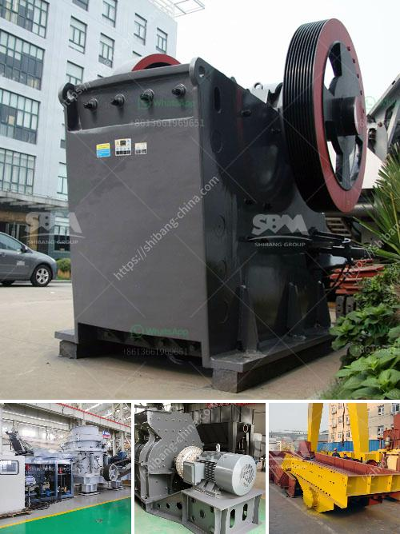

<h3>iron ore mines in ukraine</h3>
Iron ore mining in Ukraine has a rich history dating back to the early 18th century. The region holds significant reserves of iron ore, which is important for the country's economy and infrastructure. From extraction to processing, Ukraine's iron ore industry is an essential part of its mining sector.

Ukraine is the world's seventh-largest producer of iron ore, with an annual production of around 80 million metric tons. The majority of the ore mined comes from the Kryvyi Rih Basin in the Dnipropetrovsk Oblast, located in central Ukraine. This basin is estimated to have reserves of over 10 billion metric tons, making it one of the largest iron ore deposits globally.

Iron ore mining in Ukraine began in the 18th century when the ore was used to produce pig iron, and later steel. The industry grew significantly during the Soviet era, with the majority of the iron ore production coming from the Kryvyi Rih Basin. Over time, Ukraine's iron ore mines have been modernized, employing advanced technologies and equipment to enhance production efficiency and reduce environmental impact.

The iron ore mines in Ukraine are predominantly underground mines, although there are also open-pit operations. Underground mining has its advantages, as it allows for the extraction of deeper ore deposits, resulting in higher-grade iron ore. The process involves drilling and blasting to break the ore, which is then transported to the surface for further processing.

Once the ore is extracted from the mines, it goes through a series of crushing, grinding, and screening stages to obtain the desired iron ore concentrate. The concentrate is then transported to steel mills, both within Ukraine and for export to other countries. Iron ore concentrate from Ukraine is highly valued for its low impurities and high iron content, making it suitable for steel production.

Ukraine's iron ore industry plays a vital role in the country's economy. It is a significant employer, providing jobs to thousands of people, both directly and indirectly. The industry also generates substantial revenue for the government through taxes and royalties. Moreover, the iron ore sector contributes to the development of the country's infrastructure, as steel produced from Ukrainian iron ore is used in construction, transportation, and machinery manufacturing.

However, like any extractive industry, iron ore mining in Ukraine is not without challenges. The sector faces issues related to outdated equipment, aging infrastructure, and environmental concerns. Efforts are underway to address these challenges, with investments in modernizing equipment and improving environmental practices. Sustainable mining practices and responsible resource utilization are increasingly becoming a priority for Ukrainian iron ore companies.

In conclusion, Ukraine's iron ore mining industry has a long and rich history. The country's abundant reserves and high-quality ore make it a significant player in the global iron ore market. The sector contributes to Ukraine's economy through employment, revenue generation, and infrastructure development. While challenges exist, the industry is continually evolving, focused on improving mining processes and ensuring environmental sustainability.
<h3>Contact us</h3><ul><li><strong>Whatsapp:&nbsp;<a href="https://wa.me/8613661969651">+8613661969651</a></strong></li><li><a href="https://swt.shibang-china.com/?git&amp;zhl&amp;iron ore mines in ukraine"><strong>Online Service(chat now)</strong></a></li></ul><h3>Related</h3><ul><li><a href='vertical grinding machine defination.md'>vertical grinding machine defination</a></li><li><a href='crushing plant for sale.md'>crushing plant for sale</a></li><li><a href='process of gypsum board manufacturing.md'>process of gypsum board manufacturing</a></li><li><a href='types of crusher.md'>types of crusher</a></li><li><a href='used stone crusher machine from japan.md'>used stone crusher machine from japan</a></li></ul>