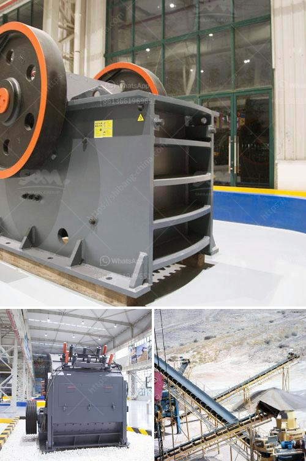

<h3>iron ore mining and beneficiation project</h3>
Iron ore mining is a thriving industry in many countries, especially those with high raw material demands for steel production. With the growing demand for steel around the world, iron ore mining has also become an attractive venture, providing valuable jobs and boosting local economies.

One such project that has gained significant attention is the iron ore mining and beneficiation project. This project aims to exploit and beneficiate low-grade iron ore found beneath the surface of the earth, making it suitable for steel production.

The primary objective of the project is to extract iron ore from underground mines using modern technology and methods. These mines are rich in low-grade iron ore, which contains a considerable amount of impurities. The first step of the project involves the careful excavation of the iron ore and transporting it to the beneficiation plant.

Once the iron ore reaches the beneficiation plant, it undergoes several processes to separate the valuable iron from the impurities. These processes include crushing, screening, grinding, magnetic separation, and gravity separation. Through these methods, the low-grade ore is enriched, and the impurities are removed, resulting in a higher-grade iron ore suitable for steel production.

The beneficiation process not only improves the quality of the iron ore but also maximizes the utilization of the natural resources. By extracting low-grade iron ore and transforming it into high-grade material, this project contributes to sustainable mining practices and reduces waste generation. It also creates job opportunities for skilled workers in the mining and beneficiation sector.

Furthermore, the iron ore mining and beneficiation project has socio-economic benefits for the local community. With increased employment opportunities, the project stimulates economic growth and improves the standard of living in the area. The income generated from the project can be reinvested in developing infrastructure, healthcare, and education facilities, thus ensuring long-term development.

Additionally, the project promotes industrial growth and the steel industry. The high-quality iron ore produced as a result of this project can be utilized by local and international steel manufacturing companies. This, in turn, contributes to the development of downstream industries, such as construction, automotive, and manufacturing, creating a ripple effect of economic growth.

It is important to note that environmental considerations play a crucial role in this project. Strict environmental regulations and sustainable practices are implemented to minimize the impact on the ecosystem and surrounding communities. Waste management systems are put in place to handle any generated residues, ensuring responsible and eco-friendly mining operations.

In conclusion, the iron ore mining and beneficiation project is an essential venture in today's steel market. It not only boosts local economies and creates employment opportunities but also contributes to sustainable mining practices and promotes the growth of downstream industries. With its holistic approach towards socio-economic development and environmental protection, this project sets an example for responsible mining in the 21st century.
<h3>Contact us</h3><ul><li><strong>Whatsapp:&nbsp;<a href="https://wa.me/8613661969651">+8613661969651</a></strong></li><li><a href="https://swt.shibang-china.com/?git&amp;zhl&amp;iron ore mining and beneficiation project"><strong>Online Service(chat now)</strong></a></li></ul><h3>Related</h3><ul><li><a href='how to set up a quarry plant.md'>how to set up a quarry plant</a></li><li><a href='stone crusher finance project myanmar.md'>stone crusher finance project myanmar</a></li><li><a href='complete stone crushing.md'>complete stone crushing</a></li><li><a href='japan used rolling mill.md'>japan used rolling mill</a></li><li><a href='used gupsum board plant sale.md'>used gupsum board plant sale</a></li></ul>