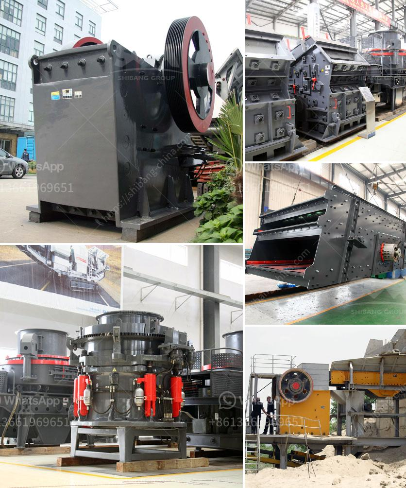

<h3>iron ore to iron process made in canada</h3>
Iron ore is a crucial resource for the global steel industry, serving as the primary ingredient in steel production. In Canada, the iron ore to iron process is a vital part of the country's economic development. Canadian iron ore mines are scattered across the country, with the largest concentration found in the Labrador Trough region of Quebec and Newfoundland.

The process of turning iron ore into iron involves several stages. Firstly, the ore is extracted from the ground through mining operations. The extracted ore is then crushed into small pieces and refined to remove impurities. Canada boasts high-quality iron ore with low impurity levels, making it highly desirable in the global market.

Once refined, the iron ore undergoes a process called sintering. Sintering involves heating the iron ore at a high temperature until it partially melts together, forming a solid mass called sinter. The sinter is then broken into smaller pieces and added to a blast furnace along with coke, limestone, and recycled steel scraps.

In the blast furnace, a powerful air blast is injected, causing the coke to burn and release carbon monoxide. This carbon monoxide reacts with the iron oxide in the sinter, reducing it to its pure iron form. The molten iron is then tapped from the bottom of the furnace and poured into molds, forming pig iron.

Pig iron is a brittle and high-carbon content iron that is further processed to remove impurities and transform it into steel. This is achieved through a process called basic oxygen steelmaking, where oxygen is injected into the molten pig iron to burn off excess carbon and other impurities. This results in the production of high-quality steel, which is essential in various industries ranging from construction to automotive manufacturing.

Canada's iron ore to iron process is driven by both domestic and international demands. The country's steel industry relies on the availability of high-quality iron ore, as it contributes significantly to the nation's GDP and employment levels. Additionally, Canadian iron ore exports play a crucial role in meeting global demand, particularly from countries with limited iron ore reserves.

The iron ore to iron process in Canada showcases the nation's commitment to sustainable mining practices. Mining companies in Canada adhere to strict environmental regulations to minimize the impact on surrounding ecosystems. They also invest in innovative technologies to reduce energy consumption and greenhouse gas emissions in the refining and steelmaking processes.

To sum up, iron ore is a valuable resource that plays a pivotal role in Canada's economic growth. The iron ore to iron process in Canada involves mining, refining, sintering, and steelmaking, resulting in the production of high-quality steel used in various industries worldwide. Through sustainable mining practices and innovation, Canada continues to contribute to the global steel market while preserving the environment for future generations.
<h3>Contact us</h3><ul><li><strong>Whatsapp:&nbsp;<a href="https://wa.me/8613661969651">+8613661969651</a></strong></li><li><a href="https://swt.shibang-china.com/?git&amp;zhl&amp;iron ore to iron process made in canada"><strong>Online Service(chat now)</strong></a></li></ul><h3>Related</h3><ul><li><a href='mobile crusher rent uae.md'>mobile crusher rent uae</a></li><li><a href='stone crusher for gold.md'>stone crusher for gold</a></li><li><a href='aggregate wash plant for sale.md'>aggregate wash plant for sale</a></li><li><a href='roller mill vs hammer mill.md'>roller mill vs hammer mill</a></li><li><a href='jaw crusher suppliers in mexico.md'>jaw crusher suppliers in mexico</a></li></ul>