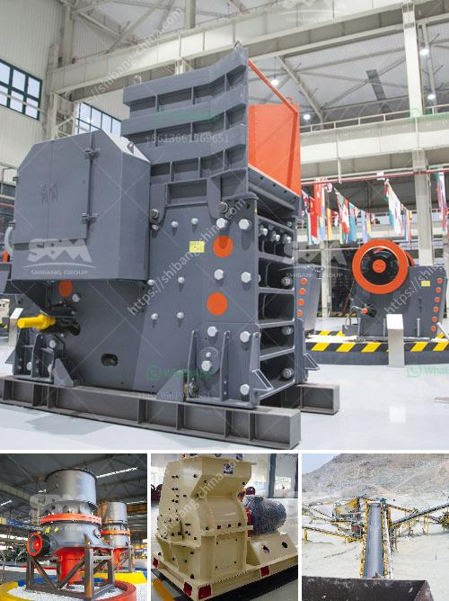

<h3>iron processing equipment price</h3>
The iron processing industry forms the backbone of numerous sectors of the global economy, such as construction, automotive, and infrastructure. Effective iron processing requires advanced equipment that is efficient, reliable, and capable of handling large-scale manufacturing operations. As such, understanding the factors influencing iron processing equipment prices is vital for companies operating in this industry.

The cost of raw materials, particularly iron ore, influences the price of iron processing equipment. Iron ore is the primary component in steel production, accounting for approximately 98% of the material used. Therefore, fluctuations in iron ore prices impact the overall production cost of iron and, consequently, the price of iron processing equipment.

Rapid advancements in technology have significantly influenced the prices of iron processing equipment. Newer technologies offer improved productivity, efficiency, and automation, leading to lower production costs. Equipment manufacturers constantly strive to develop and incorporate innovative features into their products, resulting in a wider range of high-priced machinery. However, these investments improve the overall production process, making them cost-effective choices in the long run.

Equipment prices can vary depending on the quality and durability of the machinery. Iron processing equipment built with superior materials and engineering tends to be more expensive upfront but delivers higher performance and longer service life. Such equipment reduces operational costs and downtime, contributing to a more favorable return on investment.

The size and capacity of iron processing equipment directly affect the prices. Larger machinery designed for high-volume production entails substantial investment costs due to enhanced functionality, elevated power requirements, and advanced control systems. Smaller-scale equipment tailored for specific production needs comes at a relatively lower price range.

Market dynamics, including demand and competition, exert a considerable influence on iron processing equipment prices. High demand leads to increased competition among equipment manufacturers, potentially lowering prices to attract customers. Conversely, reduced demand or limited competition can result in higher prices.

The iron processing industry has experienced significant growth over the past few decades, driven primarily by robust infrastructural development and increasing demand for steel around the world. This growth is expected to continue, propelling the demand for state-of-the-art iron processing equipment.

As governments aim to modernize infrastructure and encourage sustainable development, the iron processing industry will face new challenges and opportunities. Equipment manufacturers must adapt to changing regulations, such as those aimed at reducing carbon emissions. This paradigm shift may require significant investments in research and development, ultimately influencing equipment prices.

Efforts to automate and digitize iron processing operations will continue to shape the industry, and manufacturers' ability to integrate smart technologies could result in increased equipment prices. Automation streamlines production processes, reduces labor costs, and enhances efficiency. While initially expensive, the long-term cost savings and improved productivity outweigh the high upfront investment.

The price of iron processing equipment is influenced by various factors, including raw material costs, technological advancements, quality and durability, production capacity, market demand, and competition. As the iron processing industry continues to expand, sophisticated equipment integrating advanced technologies will be essential to stay competitive and meet evolving demands. Companies should carefully assess the cost-benefit ratio and evaluate long-term advantages when investing in iron processing equipment to remain at the forefront of the industry.
<h3>Contact us</h3><ul><li><strong>Whatsapp:&nbsp;<a href="https://wa.me/8613661969651">+8613661969651</a></strong></li><li><a href="https://swt.shibang-china.com/?git&amp;zhl&amp;iron processing equipment price"><strong>Online Service(chat now)</strong></a></li></ul><h3>Related</h3><ul><li><a href='gypsum gypsum plant supplier from germany.md'>gypsum gypsum plant supplier from germany</a></li><li><a href='marbel grinder price in pakistan.md'>marbel grinder price in pakistan</a></li><li><a href='orifice of coal mill machine.md'>orifice of coal mill machine</a></li><li><a href='rock pulverizer for manufacturing.md'>rock pulverizer for manufacturing</a></li><li><a href='costs of a cone crusher.md'>costs of a cone crusher</a></li></ul>