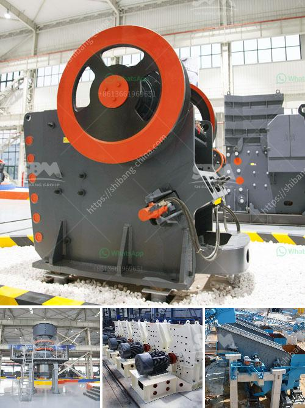

<h3>iron processing plant price</h3>
Iron processing plants play a crucial role in the manufacturing and construction industries as they are responsible for transforming iron ore into usable products such as steel. Setting up an iron processing plant requires a significant investment, and understanding the factors influencing the cost is essential for investors.

One of the primary factors affecting the price of an iron processing plant is the size and capacity of the facility. Larger plants often have higher costs due to the need for more equipment, labor, and infrastructure. The capacity of the plant also directly influences the cost, as it determines the amount of raw material that can be processed per day or hour. Investors must consider the demand and market conditions to determine the appropriate capacity for their plant.

Furthermore, the location of the processing plant influences the overall cost. Building a plant near an iron ore mine reduces transportation costs and ensures a steady supply of raw materials. On the other hand, setting up a plant in an area with a shortage of skilled labor or inadequate infrastructure may increase costs. Investors should conduct thorough research on different locations to identify the most cost-effective option.

The choice of technology and equipment is another crucial aspect that impacts the price of an iron processing plant. The industry has witnessed significant advancements in recent years, offering more efficient and environmentally friendly processes. While newer technologies may have higher upfront costs, they can result in long-term savings through reduced energy consumption and improved productivity. Investors should carefully evaluate different technologies and select the one that aligns with their budget and sustainability goals.

Labor costs are also a significant consideration for investors. Developing countries often offer cheaper labor compared to developed nations. However, it is crucial to strike a balance between cost and expertise. Skilled labor plays a vital role in the success of an iron processing plant, and compromising on quality can lead to subpar performance and higher maintenance expenses in the long run.

Additionally, investors must consider the regulatory and permitting requirements when estimating the cost of an iron processing plant. Environmental regulations, safety standards, and adherence to local laws and regulations add to the overall expenses. Conducting a thorough assessment of the legal framework in the chosen location is vital to avoid unexpected delays or legal issues.

To optimize costs, investors can also explore opportunities for sourcing financing. Government grants, loans, and tax incentives can help reduce the financial burden. Collaborating with financial institutions or seeking partnerships with other investors in the sector may provide additional support to cover the investment cost.

Lastly, market conditions and future projections should be considered when determining the price of an iron processing plant. Understanding the supply and demand dynamics of the iron and steel industry is crucial for estimating the return on investment. It is essential to evaluate factors such as current and projected steel prices and global demand for iron products to make informed decisions.

In conclusion, the price of setting up an iron processing plant depends on various factors such as plant size, capacity, location, technology, labor costs, regulatory requirements, and market conditions. Investors should conduct thorough research and analysis to assess these factors effectively. By considering these aspects, investors can estimate the cost accurately and make informed decisions regarding the establishment of an iron processing plant.
<h3>Contact us</h3><ul><li><strong>Whatsapp:&nbsp;<a href="https://wa.me/8613661969651">+8613661969651</a></strong></li><li><a href="https://swt.shibang-china.com/?git&amp;zhl&amp;iron processing plant price"><strong>Online Service(chat now)</strong></a></li></ul><h3>Related</h3><ul><li><a href='mobile crushers on tracks.md'>mobile crushers on tracks</a></li><li><a href='vertical shaft impact crusher plf.md'>vertical shaft impact crusher plf</a></li><li><a href='grinding machinery for sale in guatemala.md'>grinding machinery for sale in guatemala</a></li><li><a href='mobile crusher price list.md'>mobile crusher price list</a></li><li><a href='screening and crushing equipment for chrome.md'>screening and crushing equipment for chrome</a></li></ul>