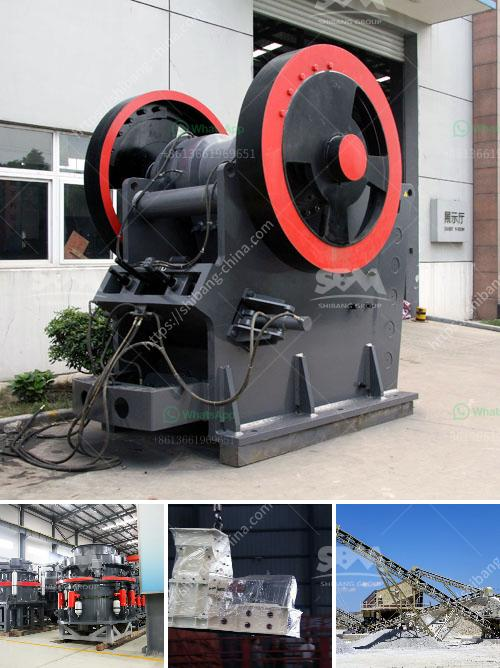

<h3>iron processing plant</h3>
Iron is one of the most essential and widely used metals in various industries. It is primarily used for manufacturing steel, which is a crucial material for construction, machinery, and transportation. To meet the ever-increasing demand for iron and steel, iron processing plants play a crucial role in extracting iron ore and transforming it into usable product.

Iron processing plants are facilities that refine iron ore into valuable steel products. These plants employ a series of complex industrial processes to extract, purify, and refine iron ore into usable materials for various industries. Let's delve deeper into the iron processing plant's operations and its significance in the modern world.

Iron ore is the primary source of iron, and its extraction process begins with the mining of iron ore deposits. Depending on the quality and quantity of the iron ore, different mining techniques are employed, such as open-pit mining or underground mining. Once the iron ore is extracted, it is transported to the iron processing plant for further refining.

At the iron processing plant, the first step is crushing the iron ore into smaller fragments. This is typically done using large crushing machinery that breaks down the ore into manageable sizes. The crushed ore is then classified into different grades based on its composition and particle size.

Next, the iron ore undergoes a process called beneficiation, where it is separated from impurities and enriched with the desired iron content. There are various techniques employed in the beneficiation process, including magnetic separation, gravity separation, and froth flotation. These processes help remove impurities, such as silica, alumina, and phosphorous, from the iron ore, resulting in a purified product.

Once the iron ore is purified, it undergoes another significant process known as smelting. Smelting involves heating the iron ore at high temperatures to extract iron and transform it into molten form. During smelting, carbon-containing materials, such as coke or charcoal, are added to act as a reducing agent. This aids in removing oxygen from the iron ore and converting it into iron metal.

After the smelting process, the molten iron is further refined using various techniques such as basic oxygen furnace (BOF) or electric arc furnace (EAF). These methods further remove impurities and adjust the composition of the iron to meet specific requirements. The refined iron is then cast into molds to form various steel products or sent to rolling mills for further processing into sheets, bars, or other shapes.

Iron processing plants are integral to the production of steel, a material that is ubiquitous in our modern world. From constructing buildings and bridges to manufacturing machinery and vehicles, steel plays a vital role in shaping our infrastructure and economy. Thus, iron processing plants are crucial for meeting the ever-growing demand for steel.

However, the iron processing industry also faces challenges concerning environmental sustainability and resource efficiency. Iron ore extraction and processing can have adverse effects on ecosystems, contribute to greenhouse gas emissions, and result in the generation of waste materials. Therefore, iron processing plants must adopt sustainable practices, such as minimizing waste generation, reducing energy consumption, and implementing efficient recycling systems.

In conclusion, iron processing plants are key facilities that play a crucial role in extracting iron ore and transforming it into usable steel products. Through a series of complex processes, iron processing plants extract and refine iron ore, ensuring the supply of steel, a vital material for various industries. However, as the demand for iron and steel continues to grow, it is essential for the iron processing industry to adopt sustainable practices that minimize environmental impact and promote resource efficiency.
<h3>Contact us</h3><ul><li><strong>Whatsapp:&nbsp;<a href="https://wa.me/8613661969651">+8613661969651</a></strong></li><li><a href="https://swt.shibang-china.com/?git&amp;zhl&amp;iron processing plant"><strong>Online Service(chat now)</strong></a></li></ul><h3>Related</h3><ul><li><a href='limestone processing in nigeria.md'>limestone processing in nigeria</a></li><li><a href='coal crusher machine china.md'>coal crusher machine china</a></li><li><a href='industrial vibrating screens.md'>industrial vibrating screens</a></li><li><a href='industrial ball mill for sale.md'>industrial ball mill for sale</a></li><li><a href='concrete crusher prices.md'>concrete crusher prices</a></li></ul>