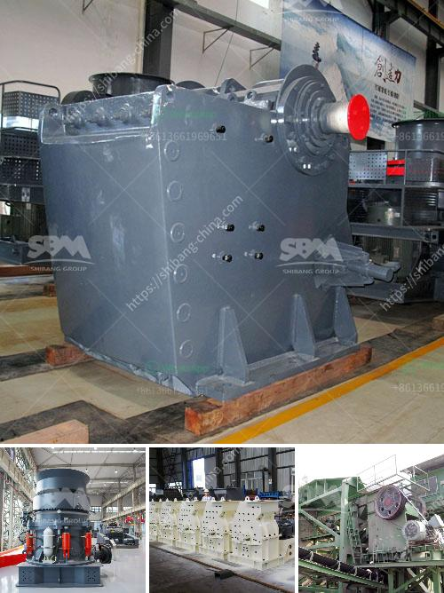

<h3>italy stone crusher manufacter</h3>
Italy is a country located in Southern Europe, famously known as the birthplace of the Renaissance, the home of various influential artists, and the hub of exquisite cuisine. However, apart from these remarkable accomplishments, Italy has also made significant contributions to the industrial sector, particularly in the manufacturing of stone crushers.

Stone crushers are machines used to reduce the size of rocks, stones, and ore. They are often utilized in aggregates production, construction material recycling, and mining operations. Crushed stones are vital resources that are consumed in large quantities for various construction purposes, such as building roads, manufacturing concrete, and producing asphalt.

Italian manufacturers have excelled in designing and producing stone crushers that are robust and reliable. Ranging from crushers for small-scale projects to large quarry machines, they provide high-quality equipment that meets the diverse needs of their customers.

In terms of crushing equipment, some of the popular machines offered by Italian manufacturers include:

1. Cone crushers: These machines combine a rotating bowl-shaped chamber with a crushing mechanism to provide precise reduction of rocks and ores.

2. Jaw crushers: Known for their ruggedness, jaw crushers are often used for primary crushing and are perhaps the most popular crushers worldwide.

3. Impact crushers: Also known as hammer crushers, these are used for crushing rocks and other materials for aggregate production, recycling, and various mining applications.

The Italian stone crushing industry has been in existence for well over a century, thanks to century-old manufacturers such as FAE Group, MB Crusher, and MEC. Today, these companies have a strong baseline to rely on when designing and manufacturing stone crushing equipment, and they are continuously enhancing their product range with innovative solutions to meet user requirements.

Italian stone crusher manufacturers continue to invest in research and development to provide its customers with cutting-edge technology and cost-effective solutions. Over time, the industry has seen substantial growth, enabling companies to expand their production facilities and increase their competitiveness in both domestic and international markets.

In conclusion, Italy's stone crusher manufacturers have a rich history that includes accomplishments ranging from inventing the cone crusher to producing efficient and reliable crushers. The impact of these advancements can be seen in the growth of the industry and the increasing number of companies operating in this space. With ongoing investments in research and development, Italy's stone crusher manufacturers are likely to continue to thrive and excel in the global market.
<h3>Contact us</h3><ul><li><strong>Whatsapp:&nbsp;<a href="https://wa.me/8613661969651">+8613661969651</a></strong></li><li><a href="https://swt.shibang-china.com/?git&amp;zhl&amp;italy stone crusher manufacter"><strong>Online Service(chat now)</strong></a></li></ul><h3>Related</h3><ul><li><a href='vibrating screen supplier.md'>vibrating screen supplier</a></li><li><a href='crsusher plant in the philippines.md'>crsusher plant in the philippines</a></li><li><a href='basalt crushing equipment.md'>basalt crushing equipment</a></li><li><a href='mobile crusher hire kenya.md'>mobile crusher hire kenya</a></li><li><a href='how to start a crushing plant.md'>how to start a crushing plant</a></li></ul>