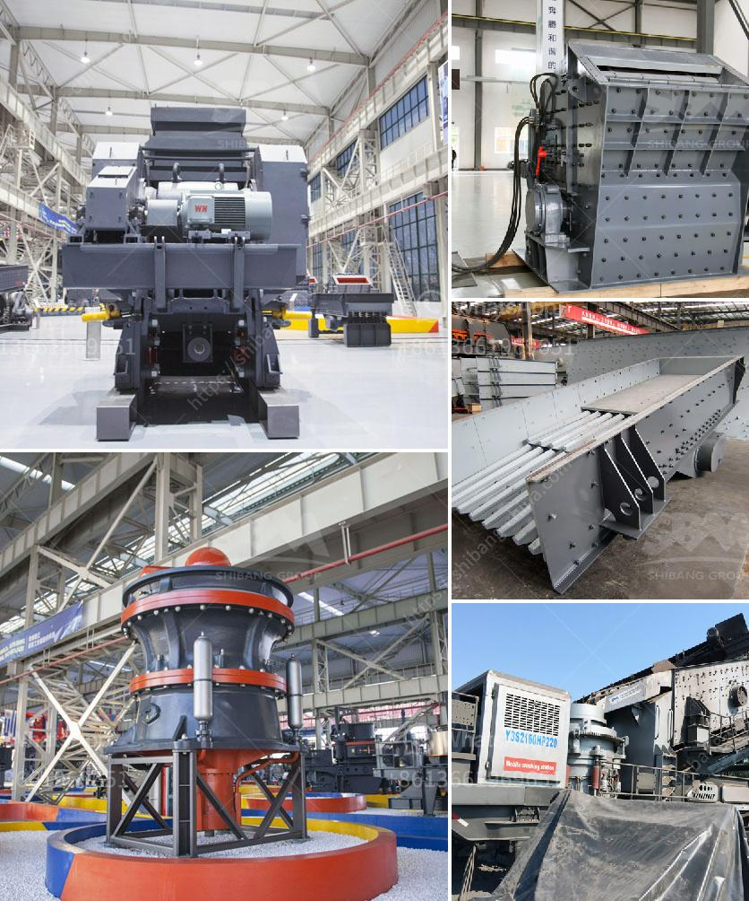

<h3>japan directory of mobile crushing plant</h3>
Japan's construction industry is known for its technological advancements and efficiency. In recent years, the industry has witnessed a surge in the utilization of mobile crushing plants, thanks to their benefits in optimizing productivity and increasing profitability. As such, Japan has developed a comprehensive directory of mobile crushing plants, empowering contractors and project managers with easy access to the most efficient machinery. This article explores Japan's directory of mobile crushing plants, highlighting their features, advantages, and the positive impact on the construction industry. 

Mobile crushing plants are designed for on-site crushing and recycling of construction waste, allowing construction companies to repurpose materials and save costs. These plants are equipped with advanced technology, including powerful jaw crushers, mobile screens, and conveyors, allowing operators to achieve high-quality aggregates in various sizes. The compact design of these plants also makes them easily transportable, enabling construction companies to move them from one site to another quickly. Additionally, mobile crushing plants are equipped with dust suppression systems, ensuring a safer and cleaner working environment. 

1. Efficiency: Mobile crushing plants are known for their high efficiency in crushing and recycling materials. They allow construction companies to crush materials on-site, thus eliminating the need for transporting materials to distant recycling facilities. This leads to significant time and cost savings for construction companies.

2. Versatility: With the ability to crush various types and sizes of materials, mobile crushing plants offer contractors versatility in their operations. Whether it's concrete, asphalt, or natural stones, these plants can process them all, making them suitable for a wide range of construction projects.

3. Environmental Sustainability: Mobile crushing plants contribute to environmental sustainability by reducing the need for new aggregate production. By recycling construction waste, these plants minimize the extraction of natural resources and alleviate the burden on landfills. This green approach aligns with Japan's commitment to sustainable development.

4. Cost-effectiveness: Mobile crushing plants help construction companies reduce costs in multiple ways. Firstly, the repurposing of materials eliminates the need for purchasing new aggregates. Additionally, the mobility of these plants minimizes transportation costs, as materials can be crushed on-site. Lastly, the productivity and efficiency of mobile crushing plants reduce labor and operating costs for construction companies.

The inclusion of mobile crushing plants in Japan's directory signifies their growing importance in the construction industry. Contractors and project managers now have easy access to a wide range of efficient and versatile machinery that can boost productivity and profitability. The integration of mobile crushing plants in construction projects has led to faster completion times, reduced waste, and improved operational efficiency. Japan's construction industry has experienced significant growth due to the successful utilization of mobile crushing plants.

Japan's directory of mobile crushing plants exemplifies the country's commitment to technological advancements and environmental sustainability in the construction industry. Contractors and project managers can now benefit from the convenience of having a comprehensive list of efficient and versatile machinery. Mobile crushing plants offer numerous advantages, including increased productivity, reduced costs, and environmental benefits. As Japan continues to emphasize the use of these plants, the construction industry is poised for further growth and efficiency in the years to come.
<h3>Contact us</h3><ul><li><strong>Whatsapp:&nbsp;<a href="https://wa.me/8613661969651">+8613661969651</a></strong></li><li><a href="https://swt.shibang-china.com/?git&amp;zhl&amp;japan directory of mobile crushing plant"><strong>Online Service(chat now)</strong></a></li></ul><h3>Related</h3><ul><li><a href='used for sale raymond roller mills india.md'>used for sale raymond roller mills india</a></li><li><a href='machine that crushes stones to ballast.md'>machine that crushes stones to ballast</a></li><li><a href='roller mill vs hammer mill.md'>roller mill vs hammer mill</a></li><li><a href='suppliers of ld slag crushing plants in india.md'>suppliers of ld slag crushing plants in india</a></li><li><a href='mini mill 12x20 jaw crusher.md'>mini mill 12x20 jaw crusher</a></li></ul>