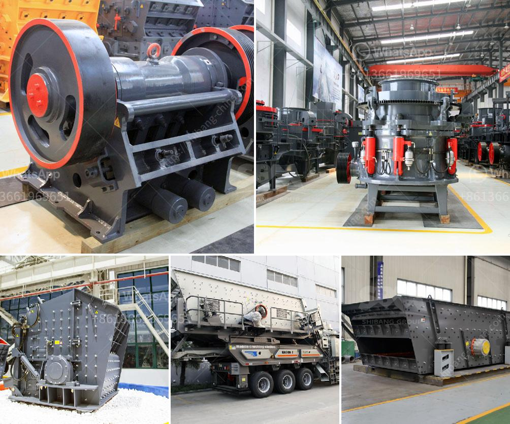

<h3>japan jaw crusher machine</h3>
Japan is unquestionably one of the most technologically advanced countries in the world. However, despite boasting some of the most advanced machinery, Japan is still heavily reliant on importing equipment that is used in the mining industry. A key piece of equipment that is utilized in this industry is the Japan jaw crusher machine.

Jaw crushers are machines that are generally used for primary and secondary crushing of materials. The main job of a jaw crusher is to crush the materials that are obtained from the quarry. This task can be done easily by ensuring that there is proper lubrication and maintenance of these machines.

Japan jaw crusher machines are doing a great job in the construction industry. These machines are commonly used in mines due to their ability to crush tough and abrasive materials. The crusher design features a swinging jaw and fixed jaw with progressive wear material options. This enables the crusher to increase the capacity and reduce the wear and tear on the jaws.

A comparison of jaw crushers with the same capacity reveals that double-toggle jaw crushers are more expensive than ordinary jaw crushers. For this reason, mostly single-toggle jaw crushers are used in the aggregate sector, while double-toggle jaw crushers are used mostly for crushing very hard and highly abrasive materials.

The lifecycle of a jaw crusher machine can vary greatly depending on how it is maintained. Sometimes, users may fail to use their jaw crushers properly, causing unnecessary damage to the machine. To ensure the longevity of a jaw crusher, proper maintenance is required.

Japan jaw crusher machines are often found in companies that handle mining of materials such as granite, basalt, ores, quartz, limestone, and others. Those companies that have excavators, to get the materials, need to have crushers. Using crushers will enable the miners to get the better quality materials and create a good-quality final product.

The advantages of using jaw crushers in the mining industry are immense. There are many cases where the machine is needed for performing big tasks. It saves a significant amount of time and effort. In addition, it increases productivity. It enables companies to produce a higher volume of good-quality materials in a shorter span of time.

Moreover, the jaw crusher machine has a relatively low operating cost. Such machines are also easy to maintain. They have a simple structure and are straightforward to operate. This makes it convenient for operators to handle the equipment.

In conclusion, Japan jaw crusher machines are greatly beneficial to the mining industry. They are characterized by simple operation, long lifespan, and high productivity. They offer producers a high volume of good-quality materials in a short span of time. These machines are a cost-effective solution for many businesses. The mining sector in Japan can greatly benefit from incorporating jaw crushers into their operations and companies should consider investing in such machines to boost their productivity levels.
<h3>Contact us</h3><ul><li><strong>Whatsapp:&nbsp;<a href="https://wa.me/8613661969651">+8613661969651</a></strong></li><li><a href="https://swt.shibang-china.com/?git&amp;zhl&amp;japan jaw crusher machine"><strong>Online Service(chat now)</strong></a></li></ul><h3>Related</h3><ul><li><a href='how much does gold ore cost.md'>how much does gold ore cost</a></li><li><a href='coal dry wash project cost.md'>coal dry wash project cost</a></li><li><a href='proposal on quarry business.md'>proposal on quarry business</a></li><li><a href='kenya mobile crusher philippines.md'>kenya mobile crusher philippines</a></li><li><a href='vibration ranges for jaw crusher.md'>vibration ranges for jaw crusher</a></li></ul>