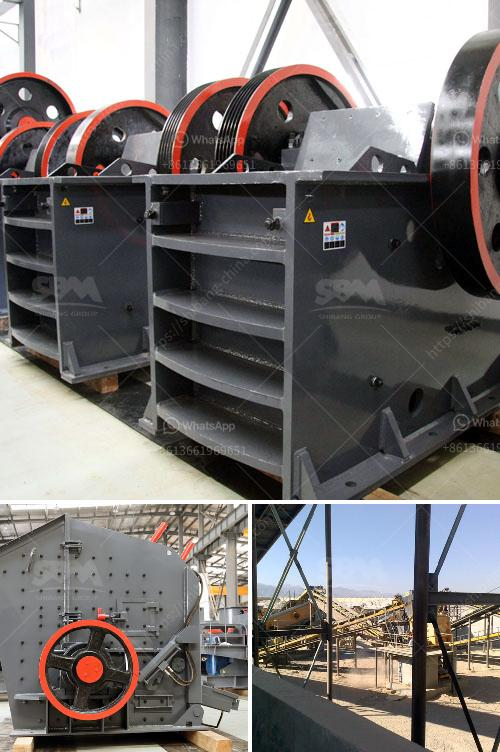

<h3>japan used mine equipment price</h3>
Japan, known for its technological prowess and advanced industrial sector, is constantly seeking ways to boost its mining capabilities. With a focus on sustainability and efficient resource extraction, the country has recently witnessed a growing trend in the demand for used mine equipment. This market presents a unique opportunity for cost-effective solutions, enabling mining enterprises to capitalize on cutting-edge technologies at affordable prices. In this article, we will explore the dynamics of the used mine equipment market in Japan.

The expansion of Japan's mining industry has created a surge in the demand for state-of-the-art equipment. However, purchasing brand-new machinery can be a substantial financial burden. This is where the used mine equipment market steps in, providing a viable alternative for businesses aiming to acquire high-quality machinery at reduced costs.

The price advantage of used mine equipment is a significant factor that pushes many mining enterprises to explore this market. Since the depreciation of heavy machinery is relatively high, sellers can offer competitive prices for used equipment. This affordability factor enables both small-scale and large-scale mining operations to upgrade their machinery, contributing to improved operational efficiency.

While opting for used mine equipment, there might be concerns about the reliability and condition of the machinery. However, industry experts ascertain that stringent quality checks and refurbishment processes are in place to ensure that equipment meets necessary safety and operational standards. Reputable sellers and brokers often provide detailed inspection reports, maintenance records, and warranties, offering buyers the assurance of the machinery's reliability and longevity.

One of the distinct advantages of used mine equipment is the opportunity to access upgraded and technologically superior models. As mining companies periodically update their equipment to keep up with emerging technologies, previously used machinery often possesses advanced features that can enhance productivity and efficiency. By purchasing these equipment models, mining enterprises can stay at the forefront of technological advancements without the exorbitant costs associated with brand-new equipment.

Sustainability and environmental preservation are crucial aspects of the mining industry. Investing in used mine equipment contributes to reducing the environmental impact associated with the production of new machinery. By prolonging the lifespan of machinery through reuse, the industry can minimize waste and conserve resources. This commitment to sustainability aligns with Japan's efforts to create a greener and more efficient mining sector.

The used mine equipment market represents a burgeoning opportunity in Japan, enabling mining enterprises to access high-quality machinery at competitive prices. By opting for used equipment, companies can benefit from cost-effective solutions, advanced technologies, and reduced environmental impact. To navigate this market successfully, it is essential for buyers to conduct thorough research, consult reliable sellers, and ensure the quality, safety, and longevity of the equipment. As the demand for resource extraction continues to rise, the used mine equipment market in Japan is set to become a prominent avenue for cost-effective and sustainable mining solutions.
<h3>Contact us</h3><ul><li><strong>Whatsapp:&nbsp;<a href="https://wa.me/8613661969651">+8613661969651</a></strong></li><li><a href="https://swt.shibang-china.com/?git&amp;zhl&amp;japan used mine equipment price"><strong>Online Service(chat now)</strong></a></li></ul><h3>Related</h3><ul><li><a href='used clinker grinding mill for sale.md'>used clinker grinding mill for sale</a></li><li><a href='vibrating screens manufacturers.md'>vibrating screens manufacturers</a></li><li><a href='crushing machine for chromium and chromite ore.md'>crushing machine for chromium and chromite ore</a></li><li><a href='crusher machine tanzania.md'>crusher machine tanzania</a></li><li><a href='layoutde a crusher machine.md'>layoutde a crusher machine</a></li></ul>