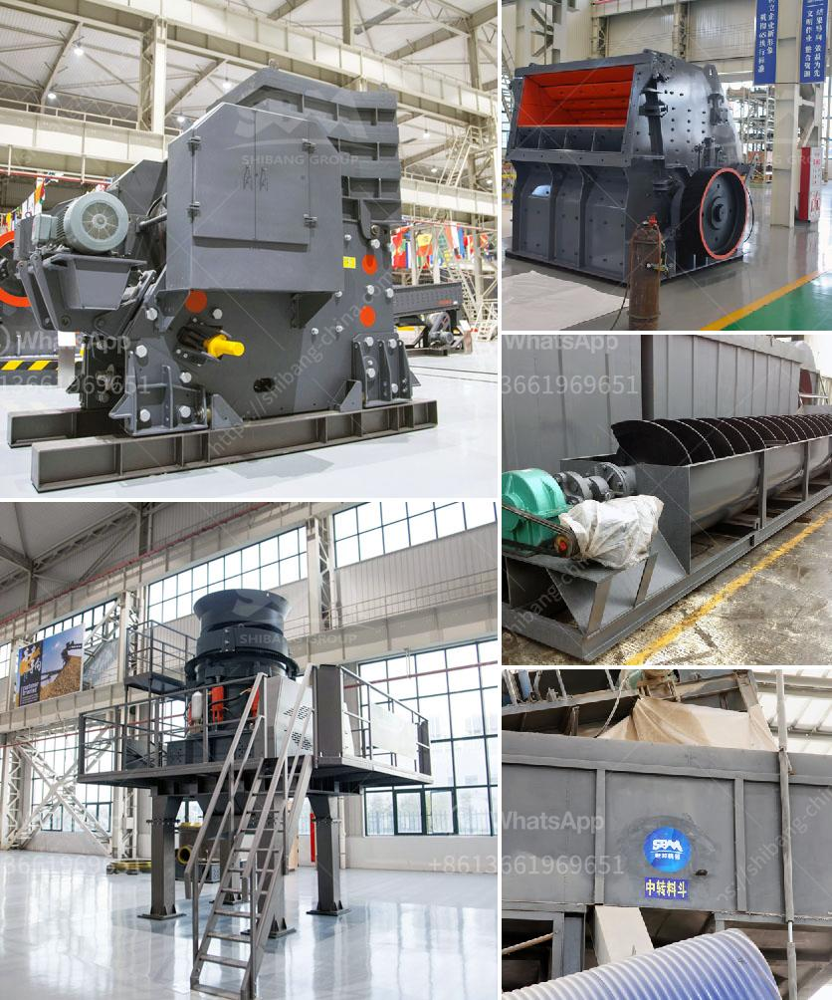

<h3>japan used rolling mill</h3>
Japan is widely renowned for its advanced technology and innovation. Among its many contributions to various industries, Japan has also made significant strides in the manufacturing and production of rolling mills. Rolling mills are an integral part of the metalworking process, used to shape and form metal sheets, bars, or wires.

The Japanese used rolling mill market is an exciting segment that has seen significant growth in recent years. A used rolling mill refers to a machine that has previously been used in metalworking operations and is now being sold on the market for a new owner to utilize. These machines are often well-maintained and offer excellent value for money.

Japanese used rolling mills are highly sought-after due to their exceptional quality, durability, and precision. Japanese manufacturers are known for their attention to detail and commitment to producing top-notch machinery. By leveraging their expertise and adhering to rigorous quality standards, these manufacturers ensure a superior product.

The demand for used rolling mills in Japan has been rising steadily due to various factors, including global economic growth, expansion of manufacturing industries, and the need for cost-effective machinery solutions. Additionally, the emergence of online marketplaces has made it easier for buyers and sellers to connect, resulting in a thriving used machinery market.

The advantages of investing in a used rolling mill extend beyond cost savings. By purchasing a machine that has been previously used, buyers can often benefit from improved lead times, compared to ordering a new machine. Additionally, used rolling mills have already undergone initial testing and fine-tuning, ensuring a smoother integration into existing production lines.

Japan's reputation for technological excellence is reflected in its used rolling mill market. For businesses in need of reliable and efficient metalworking machinery, exploring the Japanese market for used rolling mills can be a wise decision. With its high-quality offerings, competitive pricing, and a wide range of suppliers, Japan continues to play a significant role in shaping the metalworking industry globally.
<h3>Contact us</h3><ul><li><strong>Whatsapp:&nbsp;<a href="https://wa.me/8613661969651">+8613661969651</a></strong></li><li><a href="https://swt.shibang-china.com/?git&amp;zhl&amp;japan used rolling mill"><strong>Online Service(chat now)</strong></a></li></ul><h3>Related</h3><ul><li><a href='dolomite powder mill mesh.md'>dolomite powder mill mesh</a></li><li><a href='portable vibrating coal screen.md'>portable vibrating coal screen</a></li><li><a href='conveyor belt capacity.md'>conveyor belt capacity</a></li><li><a href='vibratory feeders in south africa.md'>vibratory feeders in south africa</a></li><li><a href='ballast processing.md'>ballast processing</a></li></ul>