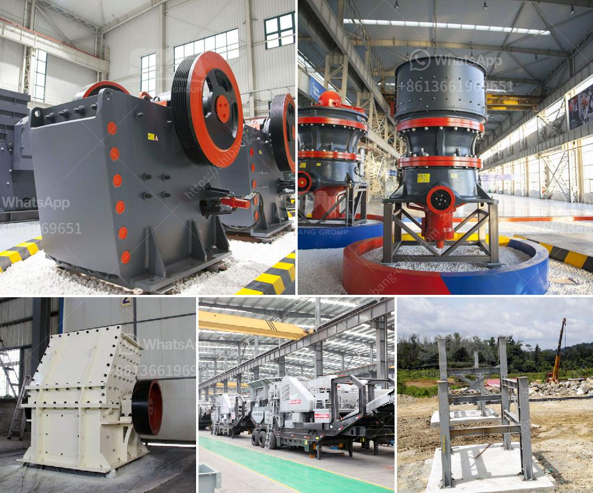

<h3>jaw crusher 0 5 t 1ton per hour</h3>
The jaw crusher is a commonly utilized equipment in the industrial sector for primary crushing of materials. The productivity of the jaw crusher is measured by the amount of material that passes through the set opening per unit time. This is often referred to as the capacity of the crusher, which is expressed in tons per hour.

One of the most common jaw crushers available in the market is the 0.5t-1ton per hour model. This crusher is light and compact, making it easy to transport and use. It utilizes an inclined plate to crush the rocks and efficiently separates the crushed particles based on size. The jaw crusher is suitable for a wide range of applications, including recycling, quarrying, and even mining.

The 0.5t-1ton per hour jaw crusher is powered by an electric motor or a diesel engine, making it versatile for use in remote areas where electrical power is limited or unavailable. Additionally, the compact size of the crusher allows it to fit into tight spaces, making it suitable for various job sites. 

With a production capacity of 0.5 to 1 ton per hour, this jaw crusher is ideal for small-scale operations or crushing smaller quantities of materials. It can be used to crush various materials, such as limestone, granite, marble, basalt, iron ore, river pebbles, etc. The adjustable discharge opening ensures that the final product size can be precisely controlled, meeting the specific requirements of different applications.

The jaw crusher has a simple structure, easy operation, and low maintenance requirements. The high-strength steel frame ensures durability and long service life, while the double-sided bearings reduce friction, heat generation, and energy consumption. The low noise and dust emissions make it environmentally friendly.

The 0.5t-1ton per hour jaw crusher offers an efficient and cost-effective solution for primary crushing needs. It saves time and labor, as it does not require manual feeding and offers a continuous and uniform feeding process. The crusher's robust design ensures it can handle tough materials and withstand heavy-duty applications. 

In conclusion, the 0.5t-1ton per hour jaw crusher is a reliable and efficient tool for crushing various materials. Its compact size, versatility, and cost-effectiveness make it suitable for small-scale operations or crushing smaller quantities of materials. Whether it is used in recycling, quarrying, or mining, this jaw crusher offers a reliable solution for primary crushing needs.
<h3>Contact us</h3><ul><li><strong>Whatsapp:&nbsp;<a href="https://wa.me/8613661969651">+8613661969651</a></strong></li><li><a href="https://swt.shibang-china.com/?git&amp;zhl&amp;jaw crusher 0 5 t 1ton per hour"><strong>Online Service(chat now)</strong></a></li></ul><h3>Related</h3><ul><li><a href='rock cone crusher.md'>rock cone crusher</a></li><li><a href='zinc ore suppliers in south africa.md'>zinc ore suppliers in south africa</a></li><li><a href='rock processing plant equipment.md'>rock processing plant equipment</a></li><li><a href='quartz powder suppliers in dubai.md'>quartz powder suppliers in dubai</a></li><li><a href='marble crusher plant in india.md'>marble crusher plant in india</a></li></ul>