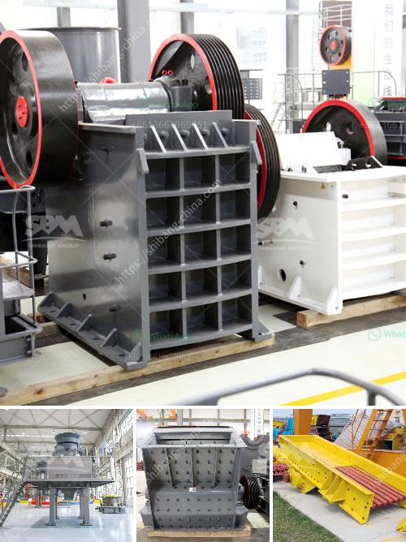

<h3>jaw crusher 400 x</h3>
The jaw crusher 400 x 600 is a very popular crusher due to its affordability, ease of use, and reliable performance. This machine has a compact design, which makes it perfect for small scale crushing projects.

The jaw crusher has an adjustable jaw setting for different materials and applications. This allows you to adjust the size of the material being crushed to suit your requirements. The maximum feed size is 350mm, and the discharge size range is 40-100mm.

The 400 x 600 jaw crusher is powered by a motor. This motor runs on a belt drive system, which allows for smooth, efficient operation. It is also equipped with a flywheel, which helps to store energy and provides the crushing force needed to break down the tough materials.

One of the main benefits of the jaw crusher 400 x 600 is its affordable price. This makes it an excellent choice for businesses or individuals who are on a budget. It provides great value for money, as it offers reliable performance at a fraction of the cost of larger crushers.

Another benefit is the ease of use. The jaw crusher has a simple design, which makes it easy to operate. It does not require any specialized training or knowledge to use effectively. This means that even inexperienced operators can use this machine with confidence.

The compact design of the 400 x 600 jaw crusher also makes it highly portable. It can be easily transported to different job sites or locations, which is especially useful for contractors who need to crush materials at various locations. It is also perfect for small scale mining operations, as it can be easily moved from one site to another.

The jaw crusher 400 x 600 is suitable for a wide range of applications. It can be used for primary crushing, secondary crushing, and even tertiary crushing of various materials. Some common applications include:

1. Construction Projects: The jaw crusher can crush construction waste, concrete, and other materials to produce aggregate for construction projects. It can also be used to crush rocks for road construction.

2. Mining: The jaw crusher is commonly used in small scale mining operations. It can crush ore, rock, and other materials to extract valuable minerals. It is often used as a primary crusher in mining operations.

3. Demolition: The powerful crushing force of the jaw crusher makes it suitable for demolishing buildings or structures. It can crush concrete, bricks, and other materials, making it easier to remove and dispose of them.

4. Recycling: The jaw crusher can be used to recycle materials such as asphalt, concrete, and waste glass. It can crush these materials into smaller pieces, which can then be recycled for other purposes.

The jaw crusher 400 x 600 is a versatile and reliable machine that is ideal for small scale crushing projects. It offers great value for money, ease of use, and portability. Whether you are in construction, mining, or recycling, this jaw crusher can effectively crush various materials and help you achieve your goals.
<h3>Contact us</h3><ul><li><strong>Whatsapp:&nbsp;<a href="https://wa.me/8613661969651">+8613661969651</a></strong></li><li><a href="https://swt.shibang-china.com/?git&amp;zhl&amp;jaw crusher 400 x"><strong>Online Service(chat now)</strong></a></li></ul><h3>Related</h3><ul><li><a href='recycled glass price per tonne in durban.md'>recycled glass price per tonne in durban</a></li><li><a href='german stone grinding machine manufacturer.md'>german stone grinding machine manufacturer</a></li><li><a href='cost of cinder powder in bangalore.md'>cost of cinder powder in bangalore</a></li><li><a href='utiliza equipos de molienda fina molino.md'>utiliza equipos de molienda fina molino</a></li><li><a href='ultra fine grinding mill.md'>ultra fine grinding mill</a></li></ul>