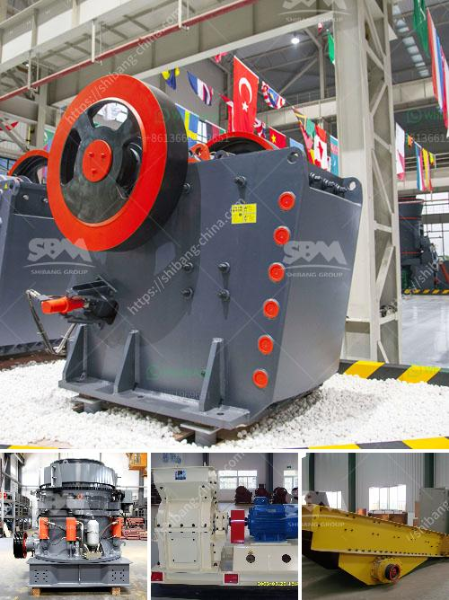

<h3>jaw crusher adaptable extec coal russian</h3>
The jaw crusher is a vital piece of machinery used in the mining industry to break down ore or rocks into smaller, more manageable sizes. It is highly versatile and adaptable, making it a preferred choice for many industries. One notable jaw crusher manufacturer is Extec, known for its durable and high-performing crushing equipment.

Extec offers a range of jaw crushers that are designed to handle various materials, including coal. Coal is a prevalent resource found in abundance in several countries, including Russia. Therefore, having a jaw crusher that can efficiently process coal is crucial for the mining industry in Russia.

Extec's jaw crushers are renowned for their robust construction, high performance, and durability even in the harshest working conditions. They are designed to withstand heavy-duty applications and are capable of processing large quantities of coal efficiently. The adaptable features of Extec's jaw crushers make them suitable for use in different mining environments, ensuring optimal performance regardless of the challenging conditions.

One of the notable features of Extec's jaw crushers is the powerful crushing mechanism. The crushers are equipped with a high-capacity jaw chamber that can deliver outstanding productivity. This makes them ideal for processing coal and other materials efficiently and quickly.

Furthermore, Extec's jaw crushers are designed with user-friendliness in mind. They are easy to operate and maintain, minimizing downtime and maximizing productivity. The jaw crushers also incorporate advanced safety features to protect the operator during operation, ensuring a safe working environment.

In conclusion, the jaw crushers offered by Extec are highly adaptable, making them appropriate for processing coal in the mining industry. Their strength, durability, and efficiency make them suitable for heavy-duty applications, ensuring optimal performance even in challenging conditions. Extec's commitment to user-friendliness and safety further enhances their appeal, making them a preferred choice for mining operations in Russia and beyond.
<h3>Contact us</h3><ul><li><strong>Whatsapp:&nbsp;<a href="https://wa.me/8613661969651">+8613661969651</a></strong></li><li><a href="https://swt.shibang-china.com/?git&amp;zhl&amp;jaw crusher adaptable extec coal russian"><strong>Online Service(chat now)</strong></a></li></ul><h3>Related</h3><ul><li><a href='scm ultra fine hammer mill price.md'>scm ultra fine hammer mill price</a></li><li><a href='plant layout mini cement plant pdf.md'>plant layout mini cement plant pdf</a></li><li><a href='kaolin processing line.md'>kaolin processing line</a></li><li><a href='concrete crusher for sale in uae crusher.md'>concrete crusher for sale in uae crusher</a></li><li><a href='stone aggregate screen in south africa.md'>stone aggregate screen in south africa</a></li></ul>