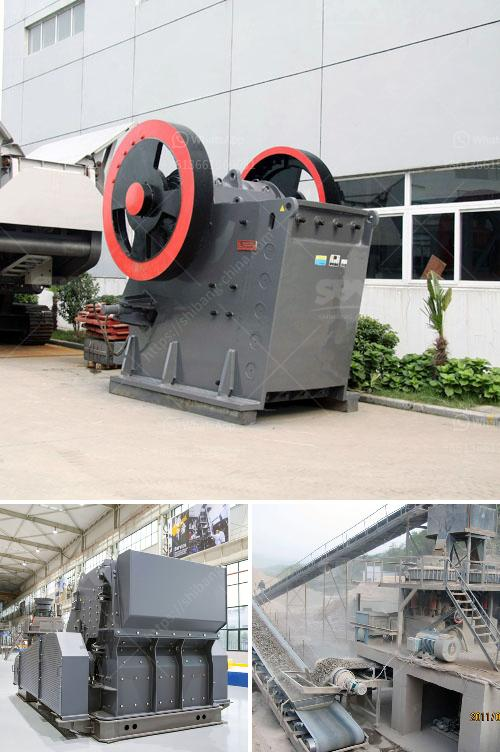

<h3>jaw crusher agen surabaya</h3>
With the advent of modern technology, the mining and construction industries are witnessing a flood of new equipment on the market. One such piece of equipment is the jaw crusher agen Surabaya, designed to enhance the efficiency of construction and mining activities. This article will explore the features and benefits of using a jaw crusher agen Surabaya in mining operations.

A jaw crusher is a powerful machine that breaks down large rocks into smaller pieces. It utilizes an oscillating motion to crush the material, resulting in reduced size and improved efficiency. The primary function of a jaw crusher is to reduce large rocks into smaller stones that can be used for construction purposes or further processed for other applications.

One of the main advantages of using a jaw crusher agen Surabaya is its versatility. Unlike other crushing equipment, a jaw crusher can handle a wide range of materials, including hard and abrasive stones, making it suitable for various mining and construction applications. Additionally, it is capable of processing different sizes of rocks, allowing for efficient utilization of material resources.

Another significant benefit of using a jaw crusher agen Surabaya is its high productivity. Its robust design and powerful motor enable it to crush rocks at a high rate, increasing the efficiency and output of mining operations. This results in higher production capacity and reduced downtime, improving overall profitability for mining companies.

In terms of maintenance, a jaw crusher agen Surabaya is relatively easy to maintain. Regular inspection and lubrication of its components are essential to ensure its smooth operation. Additionally, most jaw crushers are equipped with a reversible jaw plate, which can be easily replaced when worn out. This feature extends the lifespan of the equipment and reduces the need for frequent replacements, minimizing downtime and maintenance costs.

Furthermore, a jaw crusher agen Surabaya offers enhanced safety features, ensuring the well-being of workers in mining and construction sites. Most jaw crushers are equipped with a safety toggle plate, which prevents accidental injuries or damage to the machine during operation. Additionally, advanced models may include a hydraulic system that adjusts the opening of the crusher, preventing any unauthorized personnel from getting too close to the crushing chamber.

When considering the purchase of a jaw crusher agen Surabaya, it is essential to choose a reputable supplier. Reputable suppliers offer high-quality equipment that meets industry standards and provides after-sales support, ensuring the smooth operation and long-term durability of the machine.

In conclusion, a jaw crusher agen Surabaya is an innovative piece of mining equipment that offers numerous benefits to mining and construction operations. Its versatility, high productivity, and ease of maintenance make it an excellent investment for both small-scale and large-scale mining companies. Additionally, its enhanced safety features provide peace of mind for workers on the site. However, careful consideration and selection of a reputable supplier are crucial to ensure the reliability and efficiency of the equipment.
<h3>Contact us</h3><ul><li><strong>Whatsapp:&nbsp;<a href="https://wa.me/8613661969651">+8613661969651</a></strong></li><li><a href="https://swt.shibang-china.com/?git&amp;zhl&amp;jaw crusher agen surabaya"><strong>Online Service(chat now)</strong></a></li></ul><h3>Related</h3><ul><li><a href='process of making methanol from coal.md'>process of making methanol from coal</a></li><li><a href='200mm crusher sieve opening sizes.md'>200mm crusher sieve opening sizes</a></li><li><a href='used stone crushers in pakistan.md'>used stone crushers in pakistan</a></li><li><a href='capacity screener coal tonhcapacity stone crusher.md'>capacity screener coal tonhcapacity stone crusher</a></li><li><a href='impact crusher from china.md'>impact crusher from china</a></li></ul>