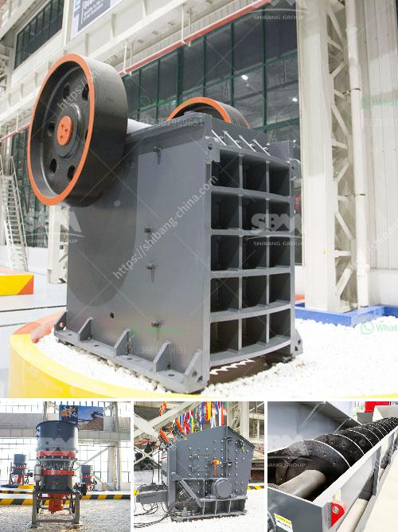

<h3>jaw crusher c160 menghancurkan peralatan</h3>
The jaw crusher C160 is one of the most commonly used primary crushing equipment for the mining and quarrying industries. This powerful machine is specifically designed to handle large rocks and ores with a maximum feed size of 1200mm in the primary crushing stage.

Made from high-quality materials, the C160 features a robust construction that ensures durability and long service life. It is equipped with a 160 kW electric motor that operates at a speed of 220 rpm, providing ample power to crush even the toughest materials. The crusher has a crushing capacity ranging from 80 to 1000 tons per hour, making it suitable for both small-scale and large-scale operations.

The C160 jaw crusher is designed with a wide and deep cavity, which provides excellent performance and high productivity. It utilizes a symmetrical V-shaped crushing chamber, ensuring even crushing throughout the entire cavity. This design reduces the chance of blockages and ensures a consistent product size.

In addition to its impressive performance, the C160 jaw crusher is also equipped with advanced features for easy operation and maintenance. It has a hydraulic setting adjustment system that allows users to easily adjust the crusher settings to achieve the desired product size. The crusher also features a hydraulic wedge system that eliminates the need for manual wedging, saving time and increasing safety.

Overall, the jaw crusher C160 is a reliable and efficient crushing equipment that is widely used in various industries. Its high crushing capacity, robust construction, and user-friendly features make it a popular choice among mining and quarrying professionals. Whether for primary crushing or secondary crushing applications, the C160 delivers exceptional performance and ensures maximum productivity.
<h3>Contact us</h3><ul><li><strong>Whatsapp:&nbsp;<a href="https://wa.me/8613661969651">+8613661969651</a></strong></li><li><a href="https://swt.shibang-china.com/?git&amp;zhl&amp;jaw crusher c160 menghancurkan peralatan"><strong>Online Service(chat now)</strong></a></li></ul><h3>Related</h3><ul><li><a href='mtw 175 tanzania mill output in 325 mesh.md'>mtw 175 tanzania mill output in 325 mesh</a></li><li><a href='what is the angle of conveyor belts.md'>what is the angle of conveyor belts</a></li><li><a href='ball mill spares manufacturers in india.md'>ball mill spares manufacturers in india</a></li><li><a href='coconut shell powder machine project report.md'>coconut shell powder machine project report</a></li><li><a href='sample contract mining agreement.md'>sample contract mining agreement</a></li></ul>