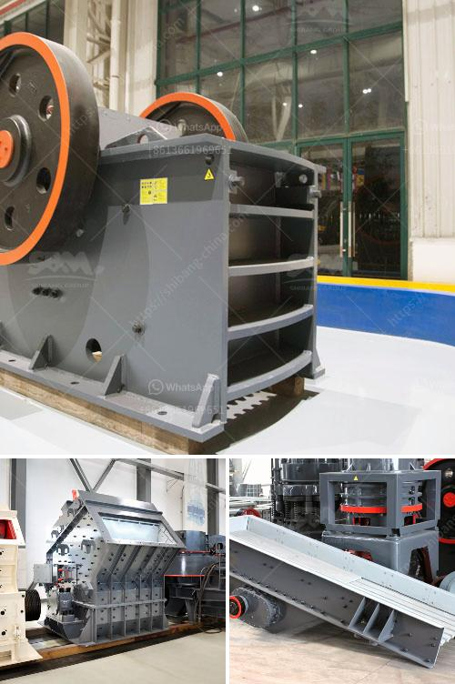

<h3>jaw crusher for sale in kenya</h3>
Jaw crusher is a common crushing machine in stone crushing production line. It is mainly used for primary crushing of various materials with compression strength less than 320MPa. The jaw crusher is widely used in mining, metallurgy, building materials, highway, railway, water conservancy and chemical industries.

Jaw crusher can crush material with a maximum compressive strength of 320MPa. There are two types of Jaw crusher: coarse jaw crusher and fine jaw crusher. Hardness, compressive strength, and moisture content of the material are the key factors that affect the selection of jaw crusher model. After the material is broken, it is discharged from the discharge port at the lower part of the machine.

The jaw crusher for sale in Kenya is used for breaking large rocks into smaller particles for subsequent processing. These machines have the advantage of large feed opening and high crushing ratio, and are well received by domestic and foreign customers. The jaw crusher for sale in Kenya can be used to crush mid-hardness, hard materials such as granite, limestone, basalt, quartz, iron ore, copper ore, construction waste, etc.

Specifications vary from model to model, and jaw crusher manufacturers in Kenya should clarify the specifications of their equipment when setting up a production line. For example, the unit weight of a 900 x 1200mm crusher is about 85 tons, the maximum feed size is 750mm, the adjustable range of discharge port is 95-165mm, the eccentric shaft speed is 200 r/min, the motor power is 110KW, the total weight of the equipment is about 28 tons, and the overall dimensions are 2850 x 2380 x 2800mm.

4. Adjustable discharge port, reliable and convenient adjustment range to meet the needs of different users.

5. Energy-saving: the energy-saving of the single machine can reach 15%-30%, and the energy-saving of the system is more than doubled.

6. Convenient maintenance: the lubrication system is safe and reliable, and the spare parts can be easily replaced.

In summary, jaw crusher for sale in Kenya is a highly efficient wear-resistant crushing machine, which can save a lot of investment costs. Our company has a professional technical team, strong after-sales service, complete models, and can provide customers with quality services. If you have any needs or questions, please feel free to consult us. We are always ready to serve you.
<h3>Contact us</h3><ul><li><strong>Whatsapp:&nbsp;<a href="https://wa.me/8613661969651">+8613661969651</a></strong></li><li><a href="https://swt.shibang-china.com/?git&amp;zhl&amp;jaw crusher for sale in kenya"><strong>Online Service(chat now)</strong></a></li></ul><h3>Related</h3><ul><li><a href='granite processing machinery.md'>granite processing machinery</a></li><li><a href='bentonite milling plant.md'>bentonite milling plant</a></li><li><a href='cobalt mobile crusher.md'>cobalt mobile crusher</a></li><li><a href='granite cone crusher.md'>granite cone crusher</a></li><li><a href='dolomite powder mill mesh.md'>dolomite powder mill mesh</a></li></ul>