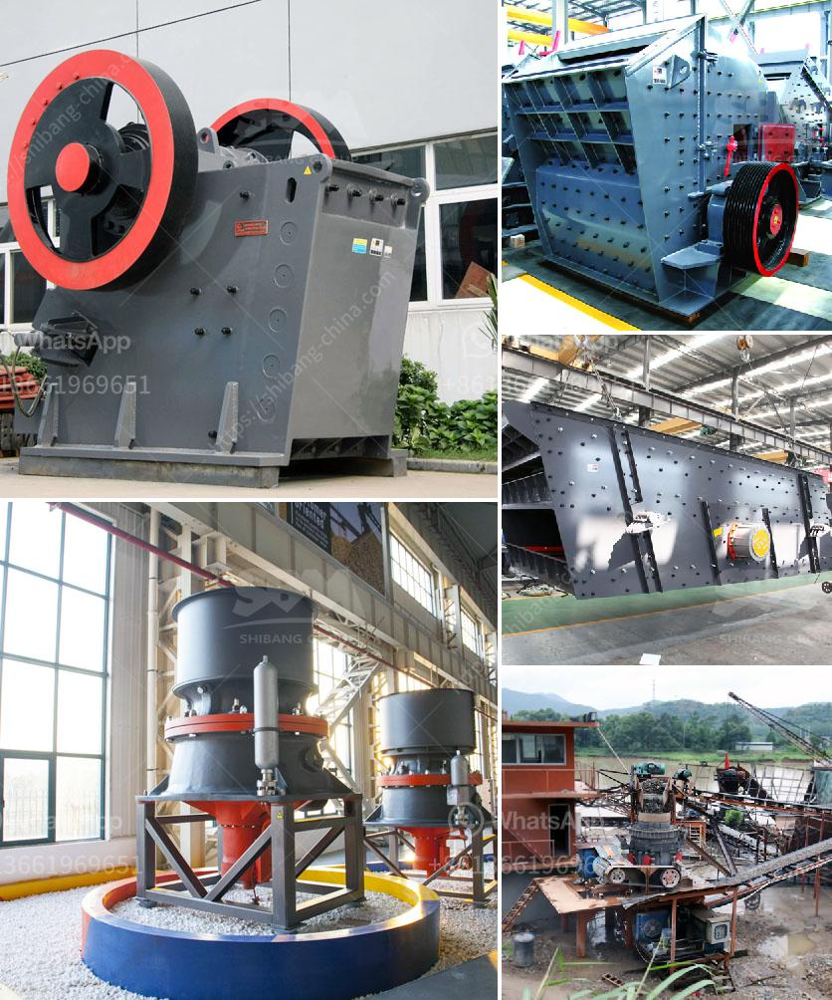

<h3>jaw crusher for sale in south africa</h3>
The jaw crusher, also known as the coarse crusher, is a common type of crusher equipment used in crushing operations. Due to its simple structure, large crushing ratio, and high output, it is widely used in mining, smelting, building materials, highways, railways, water conservancy, and chemical industries. With the rapid development of the South African economy, abundant natural resources, and infrastructure construction, the demand for jaw crushers is steadily increasing.

South Africa is rich in mineral resources and is one of the leading mining countries in the world. From coal, iron ore, gold ore, mica, and limestone to various metal ores and non-metallic ores, South Africa has abundant mineral resources, spanning multiple industries and fields. Therefore, the demand for jaw crushers is also very high in this country.

When looking for jaw crushers for sale in South Africa, customers often concern about their quality and whether the equipment can bring them high efficiency and benefits. With the continuous advancement of technology, the quality and performance of jaw crushers are constantly improving. Nowadays, many manufacturers in South Africa produce advanced jaw crushers with advanced structure, reliable operation, and convenient maintenance, making them highly favored by customers.

In addition, the jaw crusher for sale in South Africa is mainly used for primary crushing of aggregates. With the development of mineral resources and the increase in mining intensity, the demand for crushing equipment is constantly growing. As a professional jaw crusher supplier, Aimix Jaw Crusher Machine for sale totally can be your best choice if you wan to buy jaw crusher.

jaw crusher. Please feel free to give your inquiry in the form below. We will reply in 24 hours. Mobile Crushers According to the different moving modes, they can be divided into crawler-type and tire-type crushers. The crawler mobile crusher is suitable for crushing rock and ore in mines, coal mines, and construction waste recycling, earthwork engineering, urban infrastructure, roads or construction sites, and other venues. The tire-type mobile crushing station is suitable for the crushing of both natural rock and construction waste. It's simply designed to drive directly onto the work site. In the production line of the construction waste reaction station, it can even finish two tasks at the same time. Whether it is tires or crawlers, it's chassis is designed as a mobile structure, so it is capable of self driving. The hydraulically adjusted counter-attack and hammerhead type counter-attack are equipped in this mobile crushing station, making it more durable, safer and more reliable.

Overall, jaw crushers are versatile equipment that provides high productivity and efficiency, making it an ideal choice for a wide range of applications. With the increasing demand for jaw crushers in South Africa's mining and construction industries, it is essential to choose the right equipment that can help optimize your business's performance and profitability. Investing in a jaw crusher for sale from a reputable supplier like Aimix Group will ensure that you get a crusher with high-quality construction and reliable operation, enabling you to maximize your return on investment.
<h3>Contact us</h3><ul><li><strong>Whatsapp:&nbsp;<a href="https://wa.me/8613661969651">+8613661969651</a></strong></li><li><a href="https://swt.shibang-china.com/?git&amp;zhl&amp;jaw crusher for sale in south africa"><strong>Online Service(chat now)</strong></a></li></ul><h3>Related</h3><ul><li><a href='granite crushers manufacturers.md'>granite crushers manufacturers</a></li><li><a href='diamond making machines germany.md'>diamond making machines germany</a></li><li><a href='concrete stones crushing business plan.md'>concrete stones crushing business plan</a></li><li><a href='stone processing equipment turkey company.md'>stone processing equipment turkey company</a></li><li><a href='zimbabwe hammer mills.md'>zimbabwe hammer mills</a></li></ul>