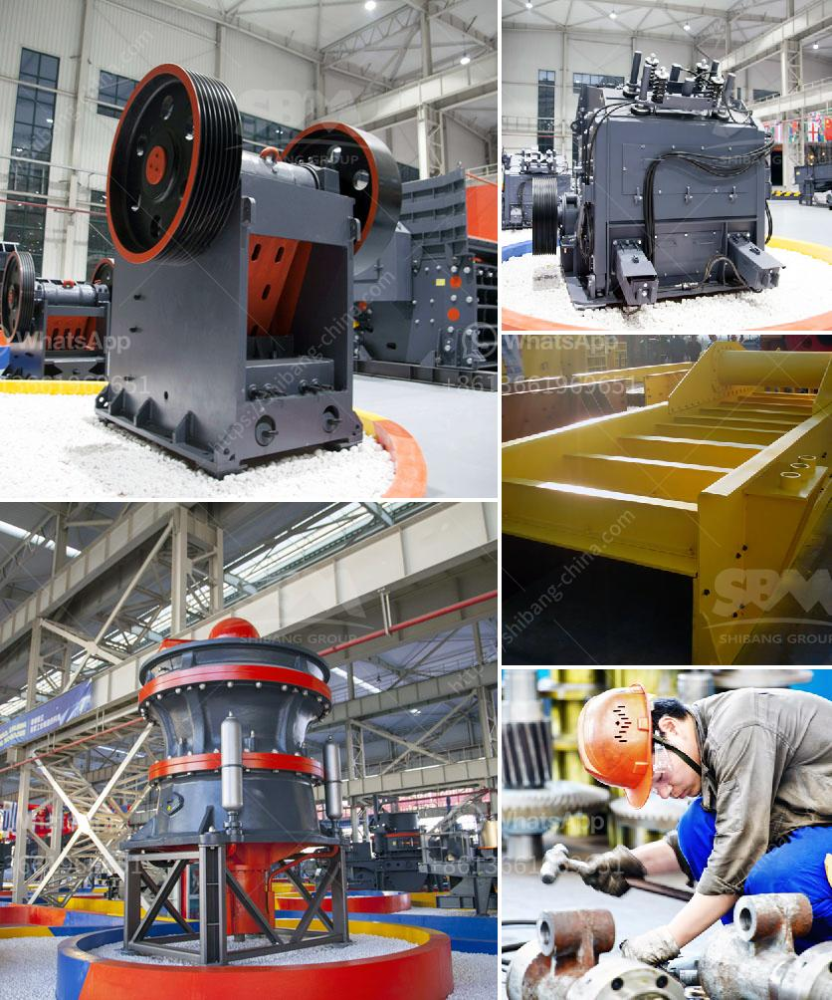

<h3>jaw crusher price in nigeria</h3>
The price of the jaw crusher in Nigeria is not fixed. There are various factors that determine the price range, such as local manufacturers, demand and supply, market competition, and other variables. The price range is quite extensive, ranging from tens of thousands to millions of naira.

With the ever-increasing demand for construction materials in Nigeria, the jaw crusher has been a trending investment choice in recent years. Due to the convenience and versatility it offers, it is a must-have machine to facilitate efficient crushing of different types of rocks and stones, depending on the specific requirements of various construction projects.

Local manufacturers play a crucial role in determining the price range of jaw crushers in Nigeria. Unlike imported crushers, locally manufactured machines are typically made with materials sourced within the country. This contributes to a significant reduction in production costs, making the jaw crushers more affordable and within reach for many individuals and small-scale businesses.

Demand and supply dynamics also influence the price of jaw crushers in Nigeria. When there is a high demand for a particular model of crusher, it becomes more expensive to purchase. On the other hand, when there is low demand, the market price is often lower because manufacturers are willing to lower prices to attract customers and maintain their market share.

Market competition is another vital factor that affects the price of jaw crushers in Nigeria. With several manufacturers and suppliers in the market, buyers have the advantage of comparing prices and selecting the best option that suits their budget and requirements. This healthy competition promotes price competitiveness and ensures that customers get the best value for their money.

Furthermore, the size and specifications of the jaw crusher also impact its price. A larger jaw crusher will require more expensive machinery and manpower to operate, leading to higher costs. Additionally, jaw crushers with more advanced features, such as adjustable discharge sizes and wireless remote control, often come with a higher price tag due to their enhanced functionality.

It is important for buyers to carefully assess their needs and budget when considering purchasing a jaw crusher. Factors such as the expected output capacity, material hardness, and maintenance requirements should be taken into consideration. This will help buyers make an informed decision about which crusher model and price range is most suitable for their specific needs.

In conclusion, the price of jaw crushers in Nigeria is influenced by various factors, including local manufacturers, demand and supply dynamics, market competition, and the size and specifications of the crusher. Affordable and high-quality machines can be found from local manufacturers, but buyers should carefully evaluate their needs and budget before making a purchase. By doing so, they can ensure that they get the best value for their money and invest in a jaw crusher that will meet their crushing requirements for years to come.
<h3>Contact us</h3><ul><li><strong>Whatsapp:&nbsp;<a href="https://wa.me/8613661969651">+8613661969651</a></strong></li><li><a href="https://swt.shibang-china.com/?git&amp;zhl&amp;jaw crusher price in nigeria"><strong>Online Service(chat now)</strong></a></li></ul><h3>Related</h3><ul><li><a href='cement grinding mill suppliers.md'>cement grinding mill suppliers</a></li><li><a href='cost sand dryer in keralan.md'>cost sand dryer in keralan</a></li><li><a href='mini sandstone crusher price.md'>mini sandstone crusher price</a></li><li><a href='crusher machine philippine price.md'>crusher machine philippine price</a></li><li><a href='antimony processing plant in south africa.md'>antimony processing plant in south africa</a></li></ul>