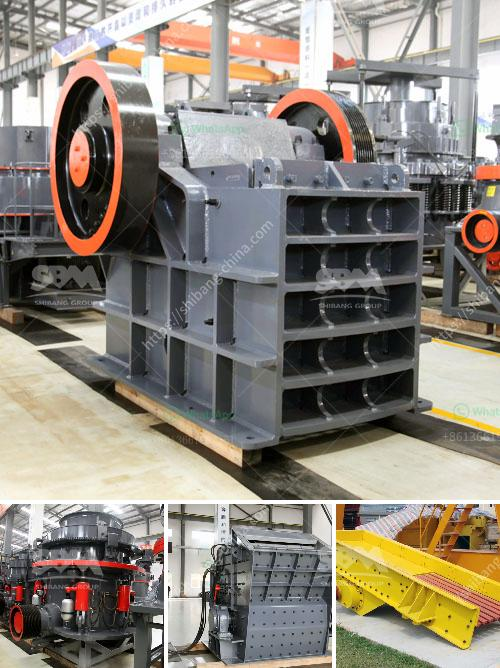

<h3>jaw crusher price philippines</h3>
When it comes to finding the right jaw crusher price Philippines, don't worry. We got you covered! The jaw crusher has been a staple of mining and quarrying industry for decades, and has been revised and improved over time. This robust crusher has earned a reputation for its high-performance capabilities, ensuring it delivers efficient crushing power all throughout its work cycle.

The sturdy construction of jaw crushers makes them ideal for crushing the toughest materials. Jaw crushers also have a certain reputation for being strong and heavy-duty machines. But with technological advancements like the newer electric jaw crushers, these heavy-duty machines have become more lightweight and energy-efficient. This reduces their overall operational costs, contributing to lower jaw crusher price Philippines options, making them perfect for both personal and industrial use.

When looking for an affordable option jaw crusher price Philippines, it's best to go to a supplier with a history of providing affordable and reliable machines. Every year, HXJQ has had more than years of development history and accumulated production experience, fully guaranteed the quality and performance of thousands of crushers that have been sold worldwide.

Keep in mind that jaw crusher price is influenced by many factors, including the brand, model, technical specifications, and productivity. If you want to get a better jaw crusher price, selecting a reliable supplier is an important step.

To meet different needs, there are different manufacturers and suppliers, ensuring that all shoppers find what suits their needs perfectly. With rapidly rising costs for grinding mills, many mining operators are looking at more economical options that still provide the needed functionality.

A variety of jaw crusher price Philippines options are available to you, such as jaw crusher, hammer crusher, and cone crusher. You can also choose from ac motor, dc motor. As well as from free samples. There are 2,615 jaw crusher price Philippines suppliers, mainly located in Asia. The top supplying countries or regions are China, Philippines, and Turkey, which supply 99%, 1%, and 1% of jaw crusher price Philippines respectively. 

These suppliers are trusted and reliable, offering competitive crusher prices for every budget. The jaw crusher price Philippines is affordable enough for small-scale production entrepreneurs. The smallest jaw crusher has a feed opening of 150*250 mm, with a production capacity of 1-3 tph.

The larger models of jaw crushers are designed to handle higher capacities and productivity. They range from feed openings of 400*600 mm to 1200*1500 mm, with production capacities ranging from 50-1000 tons per hour. 

It's important to note that the jaw crusher price Philippines might not be the only factor to look out for. It's also crucial to consider the reputation and reliability of the supplier, as well as the quality of the product they offer. The right jaw crusher supplier should ensure the equipment is durable and cost-effective, enabling its users to get the most out of their investment.
<h3>Contact us</h3><ul><li><strong>Whatsapp:&nbsp;<a href="https://wa.me/8613661969651">+8613661969651</a></strong></li><li><a href="https://swt.shibang-china.com/?git&amp;zhl&amp;jaw crusher price philippines"><strong>Online Service(chat now)</strong></a></li></ul><h3>Related</h3><ul><li><a href='scm ultra fine hammer mill price.md'>scm ultra fine hammer mill price</a></li><li><a href='hammer mills hammer mills.md'>hammer mills hammer mills</a></li><li><a href='iron ore to iron process made in canada.md'>iron ore to iron process made in canada</a></li><li><a href='price list for belt conveyor pdf.md'>price list for belt conveyor pdf</a></li><li><a href='coal washing plant design.md'>coal washing plant design</a></li></ul>