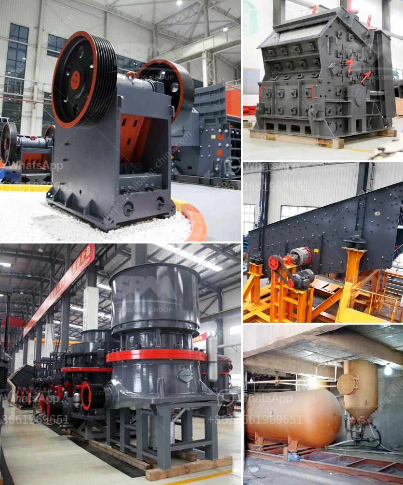

<h3>jaw crusher price south africa</h3>
The jaw crusher is an essential piece of equipment when it comes to breaking down large chunks of rocks into smaller particles for various applications. It is commonly used in the mining industry where it can be used to crush ores and other hard materials. South Africa is known for its extensive mining industry and the jaw crusher is one of the most commonly used machines in this sector.

One of the reasons why the jaw crusher is so popular in South Africa is that it is economical and efficient. The machine is relatively affordable and it can handle a wide variety of materials with ease. Additionally, the jaw crusher requires minimal maintenance, which further contributes to its cost-effectiveness. This makes it a highly sought-after piece of equipment among mining operators in South Africa.

When considering the price of a jaw crusher in South Africa, there are several factors that need to be taken into account. First and foremost, the brand and quality of the machine are essential. A reputable jaw crusher manufacturer will guarantee a reliable product that is durable and efficient. This usually comes at a higher price, but the investment is worth it in the long run.

Furthermore, the size and capacity of the jaw crusher will also impact its price. Larger crushers are capable of handling bigger rocks and have a higher capacity, which makes them more expensive. However, they are also more productive and efficient, which can result in significant cost savings over time.

In South Africa, the price range of jaw crushers is approximately between RMB 200,000 and 5 million. This price is determined by various factors such as the model, features, and capacity of the machine. In addition, different manufacturers and suppliers will also provide different prices, resulting in a wide price range.

Jaw crusher prices in South Africa are further determined by the country's volatile economic climate and currency exchange rates. However, the price of a jaw crusher is not solely dependent on the fluctuations in the market. It also depends on the quality and brand of the machine itself.

As a leading supplier of jaw crushers in South Africa, we provide customers with a variety of jaw crushers to choose from. Each of our jaw crushers has a wide range of applications and can be used in various industries, such as mining, construction, and more. Our jaw crushers are highly praised for their excellent performance and reliable quality.

In conclusion, the jaw crusher price in South Africa is affected by many factors, including the brand, model, capacity, and quality of the machine. As a professional manufacturer of jaw crushers, we strive to provide customers with durable and efficient machines at a reasonable price.
<h3>Contact us</h3><ul><li><strong>Whatsapp:&nbsp;<a href="https://wa.me/8613661969651">+8613661969651</a></strong></li><li><a href="https://swt.shibang-china.com/?git&amp;zhl&amp;jaw crusher price south africa"><strong>Online Service(chat now)</strong></a></li></ul><h3>Related</h3><ul><li><a href='superfine grinding mill.md'>superfine grinding mill</a></li><li><a href='mining equipment bow mills in zimbabwe.md'>mining equipment bow mills in zimbabwe</a></li><li><a href='iron ore to iron process made in canada.md'>iron ore to iron process made in canada</a></li><li><a href='rock jaw crusher.md'>rock jaw crusher</a></li><li><a href='stone crushing machinery.md'>stone crushing machinery</a></li></ul>