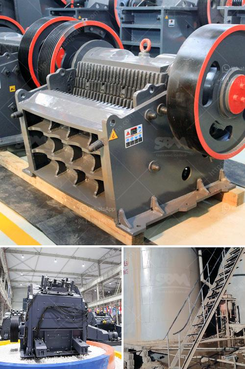

<h3>jaw crusher south africa</h3>
Jaw Crusher South Africa is a popular crushing machine in the mining industry. As a top crushing and screening equipment and crusher parts supplier in China, Stats SA recently announced that the South African construction sector recorded a significant growth in the last quarter of 2017. This growth has been attributed to increased activity in infrastructure projects, mining, and road construction. The demand for jaw crushers is significantly growing due to their increasing technological advancements and various advantages over conventional crushers.

A jaw crusher is a popular crushing machine designed for mining and construction industries. An efficient crushing machine has various features such as low energy consumption, reliable operation, and easy maintenance. This machine is also known as primary jaw crusher or primary crushers. It plays a crucial role in crushing large stones or rocks into smaller particles for various construction purposes or other industries.

The jaw crusher South Africa is used for crushing various materials, it has the advantages of simple structure, reliable performance, and easy operation. The jaw crusher South Africa is widely used in mining, metallurgical industry, building material, highway, railway, and chemical industry. It is mainly used to crush rock and ore, whose compression strength is less than 320 Mpa.

-The raw granite are collected into the hopper from the loader or truck, then the granite are fed into the jaw crusher PE750x1060 by the vibrating feeder ZSW1100x4200 for primary crushing. Then the outputs are transported to the first vibrating screen 3YZS2160 for primary screening. The outputs between 0-40mm are transported to the cone crusher CSB160/C for secondary crushing. Then the outputs from the secondary crusher are transported to the vibrating screen 4YZS2160 for screening. The size of final products can be combined and graded according to customer’s specific requirement. We can also equip dust catcher system to protect environment.

With the development of construction industry, the demand for jaw crusher South Africa is increasing day by day. Nowadays, jaw crusher South Africa is widely used in the mining industry. People know that jaw crusher always hold a very important position in the mining machinery industry. Jaw crusher South Africa has a large crushing ratio, high production efficiency, simple structure, and easy maintenance.

With the increase in demand for jaw crushers, mining investors have started to invest in infrastructure projects, road construction projects, and mining exploration. Jaw crusher manufacturers in South Africa are most concerned about the quality of equipment and operational efficiency of their equipment. It can be said that manufacturers of jaw crushers have gone through multiple stages of maturity of the equipment manufacturing process. In South Africa, the technologies in the process of developing and utilizing the jaw crusher are constantly innovating and improving. 

In conclusion, jaw crusher South Africa is popularly utilized in mining, construction, metallurgy, highway, railway, and chemical industry to crush many kinds of materials with a compressive strength lower than 320 Mpa. In recent years, jaw crusher South Africa is in need of renovation and updating due to many years of use, technological innovation, and the advantages of jaw crusher in market economy. The rapid rise of the construction industry has greatly promoted the development of jaw crusher. Jaw crusher South Africa has applications in various fields.
<h3>Contact us</h3><ul><li><strong>Whatsapp:&nbsp;<a href="https://wa.me/8613661969651">+8613661969651</a></strong></li><li><a href="https://swt.shibang-china.com/?git&amp;zhl&amp;jaw crusher south africa"><strong>Online Service(chat now)</strong></a></li></ul><h3>Related</h3><ul><li><a href='diamond equipment for mining for sale south africa.md'>diamond equipment for mining for sale south africa</a></li><li><a href='ball mill magnetic separator.md'>ball mill magnetic separator</a></li><li><a href='barangay resolution crushing plant.md'>barangay resolution crushing plant</a></li><li><a href='cone crusher plant for sale.md'>cone crusher plant for sale</a></li><li><a href='lime powder marking machines.md'>lime powder marking machines</a></li></ul>