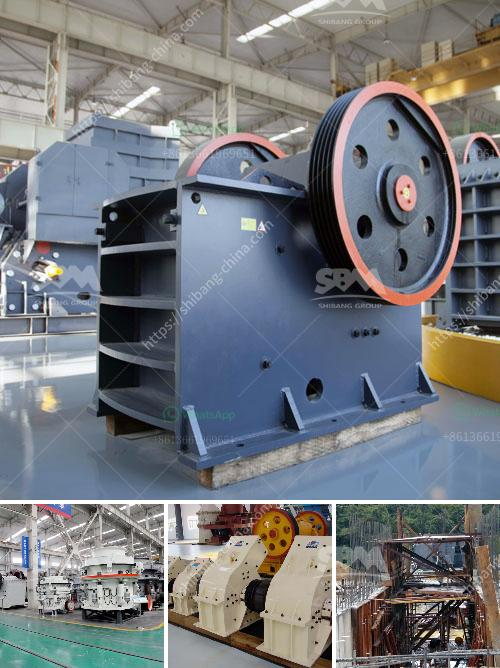

<h3>jaw crusher suppliers in mexico</h3>
Mexico is a growing economy with a booming construction and mining industry. With numerous infrastructure projects underway and a surge in mining activities, the demand for jaw crushers is on the rise. Jaw crusher suppliers in Mexico cater to this demand by providing various options in mining and construction equipment.

The jaw crusher is a versatile and essential equipment in the mining industry due to its ability to crush a variety of materials. It plays a crucial role in breaking down rocks into smaller pieces, making them suitable for further processing. Whether it is for construction, road building, or mining applications, jaw crushers are vital for efficient material handling.

Mexico has seen significant growth in its mining sector, particularly in gold, silver, and copper production. As a result, there is a need for reliable equipment that can withstand the harsh conditions of mining operations. Jaw crusher suppliers in Mexico offer durable machines that are designed to withstand such conditions.

Moreover, Mexico's construction industry is witnessing a surge in infrastructure projects, including the building of roads, bridges, and commercial complexes. Jaw crushers are often used in construction projects to crush rocks and stones into smaller sizes, making them suitable for the production of concrete and other building materials.

Jaw crusher suppliers in Mexico ensure that their machines are sturdy, reliable, and efficient in order to meet the country's growing demands. They offer machines with a range of features, including high productivity, easy maintenance, and energy efficiency. Some suppliers even provide customization options to cater to specific client requirements.

Furthermore, jaw crusher suppliers in Mexico focus on sustainable practices. They strive to manufacture equipment that is environmentally friendly, with reduced carbon emissions and improved fuel efficiency. Sustainable mining and construction practices are gaining importance worldwide, and Mexico is no exception.

In conclusion, jaw crusher suppliers in Mexico play a crucial role in supporting the growing construction and mining activities in the country. By offering durable, efficient, and sustainable equipment, they contribute to the development of a strong and thriving industry. As Mexico continues to invest in infrastructure projects and expands its mining sector, the demand for jaw crushers is expected to rise further. These suppliers are poised to meet this demand and provide the necessary equipment to drive Mexico's growth.
<h3>Contact us</h3><ul><li><strong>Whatsapp:&nbsp;<a href="https://wa.me/8613661969651">+8613661969651</a></strong></li><li><a href="https://swt.shibang-china.com/?git&amp;zhl&amp;jaw crusher suppliers in mexico"><strong>Online Service(chat now)</strong></a></li></ul><h3>Related</h3><ul><li><a href='conveyor belt capacity.md'>conveyor belt capacity</a></li><li><a href='copper ore concentration plant supplier.md'>copper ore concentration plant supplier</a></li><li><a href='micro crushers plant.md'>micro crushers plant</a></li><li><a href='quartz powder plant in india.md'>quartz powder plant in india</a></li><li><a href='costs for a stone crusher plant.md'>costs for a stone crusher plant</a></li></ul>