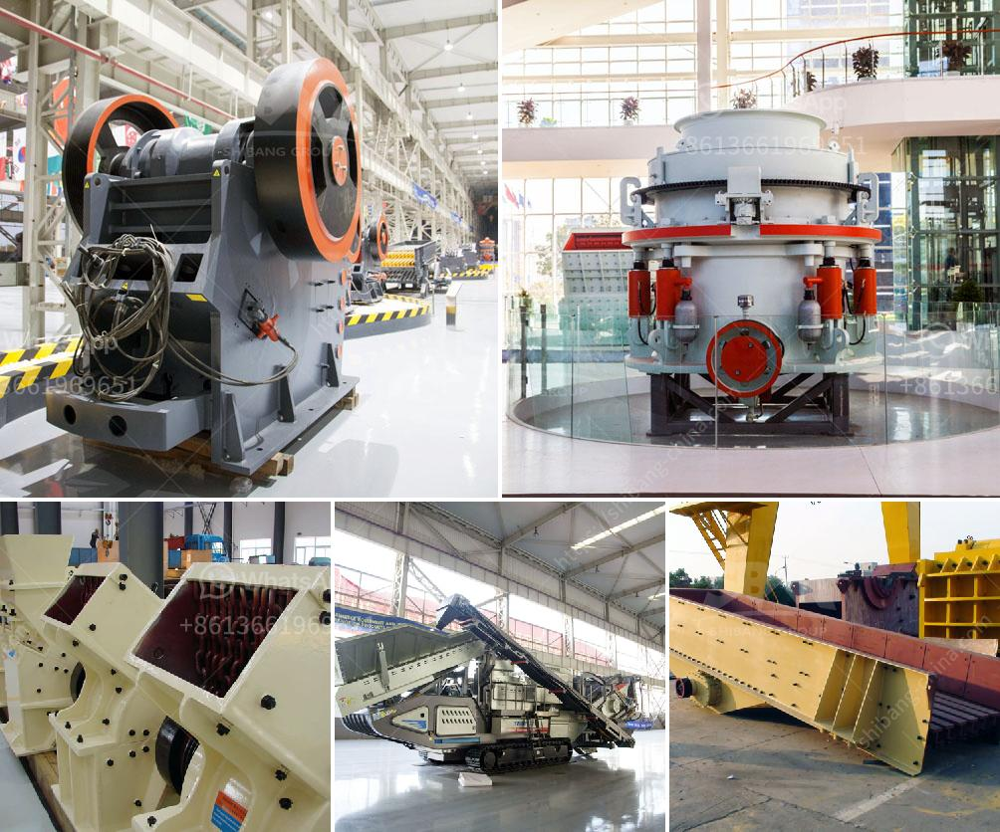

<h3>jaw crusher supply</h3>
The jaw crusher is an essential piece of equipment in many industries including mining, construction, and demolition recycling. It is used for breaking large chunks of rocks or other materials into smaller pieces. The jaw crusher has a jaw-like configuration that efficiently crushes materials by compressing them between two vertically-oriented jaws. These jaws offer a v-shaped design, thus allowing the crusher to be versatile, efficient, and safe to use.

One of the reasons why the jaw crusher is such a popular machine in these industries is its ability to easily and efficiently break down materials. The crusher's powerful jaws are designed to deliver maximum force to crush larger rocks or materials into smaller, more manageable sizes. This makes it easier for further downstream processing such as sorting, screening, and conveying.

The jaw crusher's v-shaped design also enables it to perform well in applications with hard materials or abrasive ores. It is capable of producing finely crushed materials suitable for use as a base material for road construction, concrete manufacturing, or other industrial applications. These materials can be reused, reducing the need for natural resources and minimizing waste.

Another advantage of the jaw crusher is its simplicity of design and operation. It consists of a fixed jaw and a movable jaw, which are secured at the top and bottom, respectively. The materials to be crushed are fed into the space between the jaws and are gradually crushed as the jaws move closer together. This simple mechanism ensures that the crusher is easy to operate and maintain.

When it comes to supplying jaw crushers, there is a wide range of options available in the market. Different manufacturers offer jaw crushers with varying specifications, capacities, and features. Some manufacturers specialize in producing heavy-duty jaw crushers suitable for mining and quarrying applications, while others focus on more compact models for construction and demolition recycling.

Additionally, the jaw crusher supply also includes various optional features and accessories that enhance its performance and versatility. These may include adjustable crushing chambers, hydraulic adjustment systems, automatic lubrication systems, and remote control operation. Customers can choose the jaw crusher that best suits their specific needs and requirements.

In conclusion, the jaw crusher is an essential piece of equipment in many industries. Its ability to efficiently crush materials and its simplicity of design and operation make it a valuable asset for any company. With a wide range of jaw crusher models and accessories available in the market, customers can find the perfect crusher to meet their crushing needs.
<h3>Contact us</h3><ul><li><strong>Whatsapp:&nbsp;<a href="https://wa.me/8613661969651">+8613661969651</a></strong></li><li><a href="https://swt.shibang-china.com/?git&amp;zhl&amp;jaw crusher supply"><strong>Online Service(chat now)</strong></a></li></ul><h3>Related</h3><ul><li><a href='coal mill grinding media wear rate.md'>coal mill grinding media wear rate</a></li><li><a href='limestone production plant.md'>limestone production plant</a></li><li><a href='quarry machine manufacturers.md'>quarry machine manufacturers</a></li><li><a href='cone crusher for sale in south africa.md'>cone crusher for sale in south africa</a></li><li><a href='diamond screening plant for hire south africa.md'>diamond screening plant for hire south africa</a></li></ul>