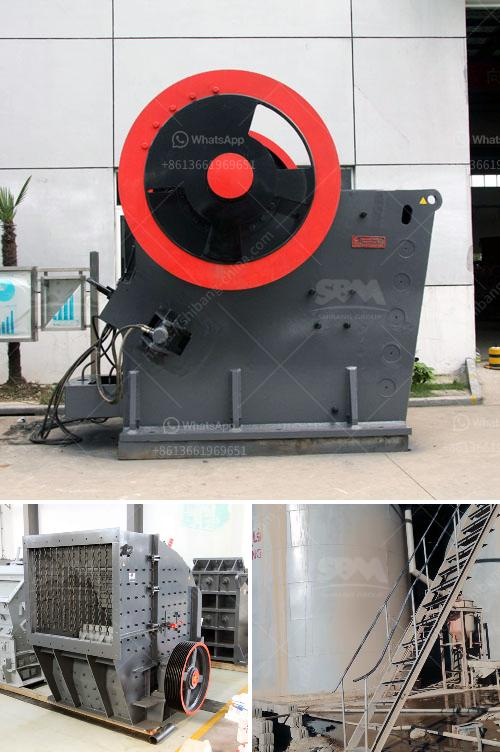

<h3>jaw crusher thailand</h3>
The jaw crusher is a versatile machine that is capable of breaking down materials into smaller pieces. As its name suggests, it works by pressing materials between two heavy metal jaws. The machine has a powerful jaw that applies mechanical force to materials in order to break them into smaller pieces.

In Thailand, the jaw crusher has gained popularity due to its ability to crush materials efficiently. It is commonly used in various industries, including mining, building materials, metallurgy, electric power, chemical engineering, and so on. As a result, jaw crushers are widely utilized in Thailand for quarrying, rock demolition, and recycling.

One of the main advantages of the jaw crusher is its ability to handle large feed sizes, making it particularly suitable for primary crushing. The machine has a wide feed opening that can accommodate feed sizes of up to several hundred millimeters. This allows it to process large chunks of materials, reducing the need for secondary crushers.

Another advantage of the jaw crusher is its simplicity of operation. The machine has a straightforward design, consisting of a fixed jaw and a movable jaw. The fixed jaw is fixed vertically to the machine frame, while the movable jaw is attached to a pendulum-like mechanism. This allows the jaws to move back and forth, crushing the materials in between.

The most common jaw crusher in Thailand is the single toggle jaw crusher, which is designed with an upward thrust toggle plate that generates a uniform motion throughout the crushing chamber. It allows for a high throughput and improved crushing efficiency. This type of jaw crusher is ideal for materials with compressive strength of less than 320 MPa.

In recent years, the jaw crusher in Thailand has undergone several improvements. One notable advancement is the use of hydraulic systems, which allows for easier adjustment of the machine's settings. With just a push of a button, the operator can adjust the jaw's discharge size, making it more versatile and efficient.

Furthermore, manufacturers have also focused on reducing the machine's environmental impact. Modern jaw crushers are designed to be more energy-efficient, reducing both fuel consumption and carbon emissions. Additionally, some models are equipped with dust suppression systems, which minimize the release of dust and other airborne pollutants, improving the working environment.

In conclusion, the jaw crusher is a powerful machine that is widely used in Thailand for various applications. Its ability to handle large feed sizes, simplicity of operation, and environmental-friendly features make it a preferred choice in the mining and construction industries. As technology continues to advance, we can expect further improvements in the jaw crusher's performance and efficiency.
<h3>Contact us</h3><ul><li><strong>Whatsapp:&nbsp;<a href="https://wa.me/8613661969651">+8613661969651</a></strong></li><li><a href="https://swt.shibang-china.com/?git&amp;zhl&amp;jaw crusher thailand"><strong>Online Service(chat now)</strong></a></li></ul><h3>Related</h3><ul><li><a href='raymond mill manufacturer.md'>raymond mill manufacturer</a></li><li><a href='crusher unit daily production capacity.md'>crusher unit daily production capacity</a></li><li><a href='crushing machine manufacturer.md'>crushing machine manufacturer</a></li><li><a href='project report granite cutting file.md'>project report granite cutting file</a></li><li><a href='graphite processing plant.md'>graphite processing plant</a></li></ul>