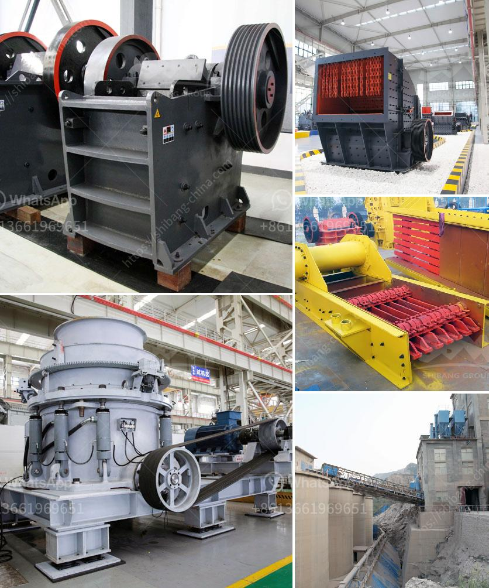

<h3>jaw crushers supplier</h3>
Jaw crushers are useful tools in the mining and construction industries. They can crush different types of materials, including hard rocks and ores, and they are commonly used in underground mining operations. These machines are often found in quarries and mines, where they are used to break down large rocks into smaller, more manageable pieces.

When it comes to finding a reliable jaw crushers supplier, there are a few factors to consider. One of the most important aspects is the quality of the machines they provide. A good supplier will offer jaw crushers that are well-built and made from durable materials. This ensures that the machines can withstand the demanding conditions of mining and construction sites.

In addition to quality, it is also important to choose a supplier that offers a variety of jaw crushers to meet different needs. Some projects may require smaller, more mobile crushers, while others may need larger machines for heavy-duty crushing. A supplier that offers a range of options can help customers find the right crusher for their specific applications.

Another important factor to consider when choosing a jaw crushers supplier is their level of customer support. Working with a supplier that offers excellent customer service can make a big difference in the overall experience. A reputable supplier will be responsive to customer inquiries, provide accurate and detailed information about their products, and offer assistance in choosing the right crusher for specific needs.

Furthermore, it is beneficial to choose a supplier that offers after-sales support. Jaw crushers are complex machines that require regular maintenance and occasional repairs. Finding a supplier that offers spare parts and services for their crushers can save time and money in the long run. It is also advisable to check if the supplier offers training and technical support to help customers operate and maintain the machines properly.

When looking for a jaw crushers supplier, it is also essential to consider their reputation in the industry. Good suppliers will have a track record of providing reliable and high-quality products. Reading customer reviews and testimonials can provide insights into the supplier's reputation and the experiences of their past customers. Additionally, it is worth checking if the supplier is certified and adheres to industry standards and regulations.

In conclusion, choosing the right jaw crushers supplier is crucial for successful mining and construction projects. It is important to consider factors such as the quality of the machines, the variety of options available, customer support, after-sales services, and reputation in the industry. By selecting a reputable and reliable supplier, customers can ensure that they are investing in high-quality crushers that will meet their specific needs and provide long-lasting performance.
<h3>Contact us</h3><ul><li><strong>Whatsapp:&nbsp;<a href="https://wa.me/8613661969651">+8613661969651</a></strong></li><li><a href="https://swt.shibang-china.com/?git&amp;zhl&amp;jaw crushers supplier"><strong>Online Service(chat now)</strong></a></li></ul><h3>Related</h3><ul><li><a href='trommel screen for sale south africa.md'>trommel screen for sale south africa</a></li><li><a href='japan directory of mobile crushing plant.md'>japan directory of mobile crushing plant</a></li><li><a href='hammer mill machinery in namibia.md'>hammer mill machinery in namibia</a></li><li><a href='conveyor belts specifications.md'>conveyor belts specifications</a></li><li><a href='washing plant for silica.md'>washing plant for silica</a></li></ul>