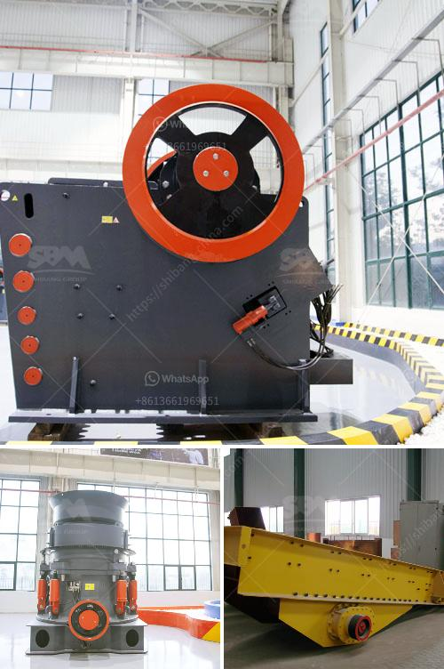

<h3>jaw crushing machine</h3>
In the mining industry, crushing is an essential step to process ore efficiently and extract valuable minerals. With the development of more efficient technologies, crushing machines have become an integral part of mining operations. However, a jaw crushing machine stands out from all other crushers for its ability to effectively and reliably break down hard materials, resulting in high-quality end products.

A jaw crushing machine is a powerful equipment that enables producers to uniformly break down large rocks into smaller, manageable sizes. The machine’s jaw chamber features an aggressive nip angle, allowing it to consistently grab and process material effectively without any slippage or inefficiencies. This unparalleled crushing action significantly improves the productivity and efficiency of mining operations.

One of the main advantages of jaw crushing machines is their versatility. They can handle a wide range of materials, including hard and abrasive ones, making them suitable for various industrial and mining applications. From limestone and granite to iron ore and hard rock, jaw crushing machines can easily handle these materials, reducing them to sizes suitable for further processing. Moreover, the adjustable closed side setting on the machine allows operators to control the size of the end product, ensuring it meets specific requirements.

Another factor that sets jaw crushing machines apart is their durability and low maintenance requirements. Built with heavy-duty components, these machines are designed to withstand the harsh conditions of mining operations. Additionally, they require minimal maintenance, reducing downtime and increasing overall productivity. This allows mining companies to focus on their core operations without worrying about constant repairs or replacements.

Furthermore, jaw crushing machines are known for their energy efficiency. As energy costs continue to rise, it is essential for mining operations to have equipment that consumes less energy while maintaining high performance standards. Jaw crushers are specifically engineered to reduce energy consumption without compromising productivity. With advanced technologies and optimized designs, these machines provide reliable and consistent performance while reducing overall operational costs.

The advantages of jaw crushing machines are not limited to the mining industry alone. They are also widely used in various other industries, such as construction, demolition, and recycling. Their versatility makes them suitable for a wide range of applications, where the ability to break down hard materials efficiently and produce high-quality end products is crucial.

In conclusion, a jaw crushing machine is a game-changer for the mining industry. Its ability to crush hard materials efficiently, produce high-quality end products, and withstand the harshest conditions sets it apart from other crushers. The versatility, durability, and energy efficiency of these machines make them an essential tool for maximizing productivity and minimizing operational costs in mining operations. As technologies continue to evolve, jaw crushing machines will undoubtedly play a pivotal role in the future of the mining industry.
<h3>Contact us</h3><ul><li><strong>Whatsapp:&nbsp;<a href="https://wa.me/8613661969651">+8613661969651</a></strong></li><li><a href="https://swt.shibang-china.com/?git&amp;zhl&amp;jaw crushing machine"><strong>Online Service(chat now)</strong></a></li></ul><h3>Related</h3><ul><li><a href='kenya hammer mill is manufactured.md'>kenya hammer mill is manufactured</a></li><li><a href='300tpd mini cement plant task cost in india.md'>300tpd mini cement plant task cost in india</a></li><li><a href='germany gypsum production line.md'>germany gypsum production line</a></li><li><a href='financial projection of a quarry business.md'>financial projection of a quarry business</a></li><li><a href='marbel grinder price in pakistan.md'>marbel grinder price in pakistan</a></li></ul>