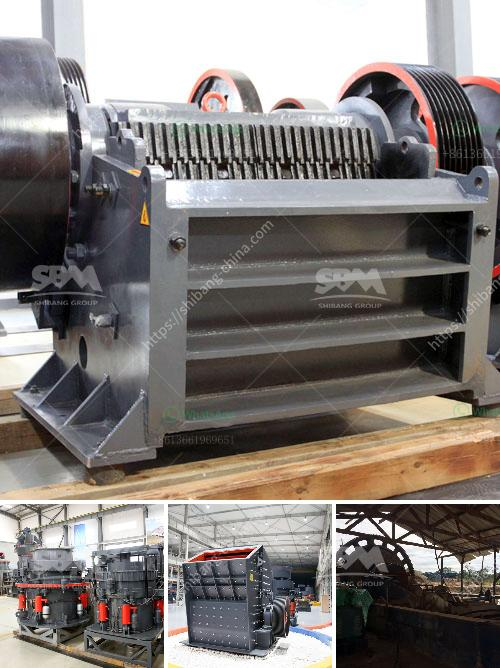

<h3>jaw plate for jaw crusher breaker</h3>
Jaw crushers are heavy-duty machines designed to efficiently crush hard and abrasive materials, including rocks and ores. One of the key components of these machines is the jaw plate, which acts as a protective shield for the movable jaw and crucially ensures the efficient crushing of materials.

The jaw plate is typically made of high manganese steel, a material known for its exceptional wear resistance and toughness. This robust construction allows the jaw plate to endure the intense forces generated during the crushing process, protecting the crusher's main components.

The jaw plate's design can vary depending on the type of jaw crusher and the specific requirements of the application. In general, the jaw plate consists of two main parts: the fixed jaw plate and the movable jaw plate. These two components work together to crush the material, with the fixed jaw plate acting as a stationary surface against which the movable jaw plate exerts force to crush the material.

The jaw plate's shape and profile can also have a significant impact on the crusher's performance. Different tooth profiles, such as square, corrugated, and flat, are available, each designed to optimize the crushing process for specific types of materials. Additionally, the jaw plate's profile can be asymmetrical to increase the throughput capacity or improve the product shape.

As the jaw plate is constantly subjected to wear and tear, regular inspection and maintenance are crucial to ensure its optimal performance. Periodically checking for any signs of wear, such as cracks, deformation, or excessive wear in specific areas, allows for timely replacements and prevents unplanned downtimes.

In conclusion, the jaw plate is an essential component of a jaw crusher breaker. Its construction, material, shape, and profile play a significant role in maximizing the crusher's efficiency and performance. By regularly inspecting and maintaining the jaw plate, operators can ensure longer equipment life, improved productivity, and reduced downtime.
<h3>Contact us</h3><ul><li><strong>Whatsapp:&nbsp;<a href="https://wa.me/8613661969651">+8613661969651</a></strong></li><li><a href="https://swt.shibang-china.com/?git&amp;zhl&amp;jaw plate for jaw crusher breaker"><strong>Online Service(chat now)</strong></a></li></ul><h3>Related</h3><ul><li><a href='stone crusher machine from uk.md'>stone crusher machine from uk</a></li><li><a href='vibratory screen manufacturer.md'>vibratory screen manufacturer</a></li><li><a href='ultrafine grinder for producing powder.md'>ultrafine grinder for producing powder</a></li><li><a href='list of crusher plant.md'>list of crusher plant</a></li><li><a href='gypsum manufacturing unit in nigeria.md'>gypsum manufacturing unit in nigeria</a></li></ul>