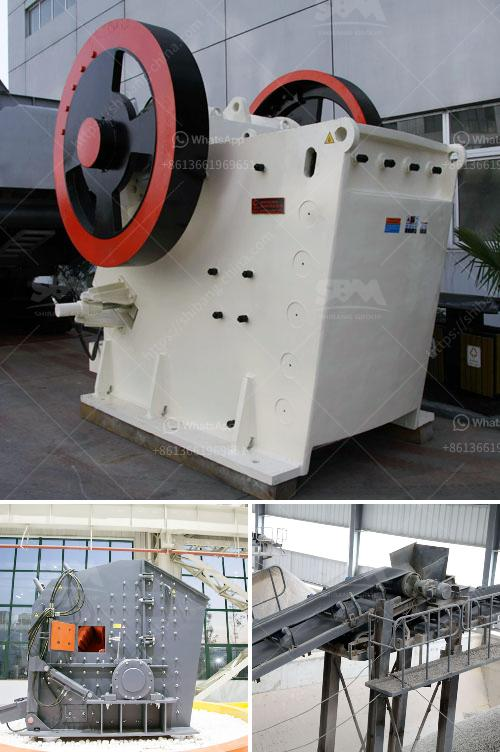

<h3>jual belt conveyor surabaya</h3>
Material handling is a critical process in various industries, including manufacturing, mining, and construction. It involves the transportation, storage, and control of materials throughout the production or project cycle. One of the key components of an efficient material handling system is a belt conveyor.

A belt conveyor is a device used to move materials from one place to another, utilizing a belt made of rubber, PVC, or other materials. It is commonly used in factories, warehouses, airports, and other industrial settings to transport bulk materials such as grains, ores, coal, and even small-sized products like boxes or packages.

In Surabaya, Indonesia, there is a growing demand for reliable and high-quality belt conveyors. Thankfully, there are companies that specialize in jual belt conveyor Surabaya, offering a wide range of conveyor systems to cater to different needs and requirements.

One of the primary benefits of using a belt conveyor is its efficiency in moving large volumes of materials quickly and continuously. Compared to manual handling or using other transportation methods, belt conveyors can significantly reduce labor requirements, save time, and increase productivity. They can transport materials horizontally, inclined, or in a combination of both, making them versatile for various applications.

The design and features of belt conveyors can vary based on the specific needs of the industry or application. For example, heavy-duty belt conveyors are commonly used in industries that handle large and heavy materials. These conveyors are built with sturdy frames, powerful motors, and durable belts to handle the load without any issues.

On the other hand, there are also belt conveyors designed for lightweight and smaller materials. These conveyors may have narrower belts and lower power requirements, making them more suitable for industries that handle smaller products or components.

When looking for a jual belt conveyor Surabaya, it is essential to consider the reliability and durability of the conveyor system. A well-built belt conveyor should be able to withstand the demanding conditions of industrial environments and provide years of service without frequent breakdowns or maintenance issues.

Furthermore, the company offering jual belt conveyor Surabaya should provide excellent customer service, including installation, maintenance, and after-sales support. It is crucial to choose a reliable supplier that is committed to customer satisfaction and can provide quick and efficient solutions to any conveyor-related problems.

In conclusion, a belt conveyor is a crucial component of an efficient material handling system. In Surabaya, there are reputable companies that specialize in jual belt conveyor Surabaya, providing a wide range of conveyor systems to meet various industrial needs. Investing in a high-quality belt conveyor can significantly improve productivity, reduce labor requirements, and ensure the smooth and continuous flow of materials in your business operations.
<h3>Contact us</h3><ul><li><strong>Whatsapp:&nbsp;<a href="https://wa.me/8613661969651">+8613661969651</a></strong></li><li><a href="https://swt.shibang-china.com/?git&amp;zhl&amp;jual belt conveyor surabaya"><strong>Online Service(chat now)</strong></a></li></ul><h3>Related</h3><ul><li><a href='vertical shaft crusher.md'>vertical shaft crusher</a></li><li><a href='cement grinding mill suppliers.md'>cement grinding mill suppliers</a></li><li><a href='limestone processing plant supplier.md'>limestone processing plant supplier</a></li><li><a href='crushers for rent in oman.md'>crushers for rent in oman</a></li><li><a href='stone crushing machinery.md'>stone crushing machinery</a></li></ul>