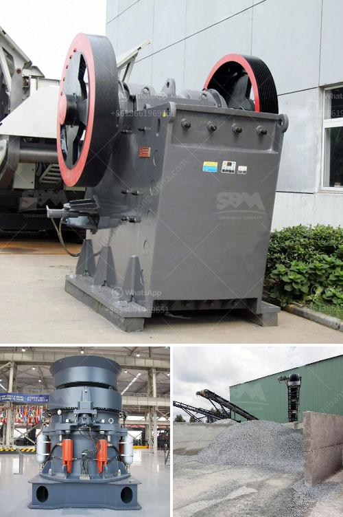

<h3>kaolin crusher plant in uzbekistan</h3>
Kaolin, also known as china clay, is a white, soft, and versatile mineral that is commonly used in the production of porcelain, ceramics, paper, rubber, plastics, paints, and many other products. Kaolin is found in abundance in many regions around the world, including Uzbekistan, where one of the largest kaolin deposits can be found.

Kaolin mining in Uzbekistan is a significant industry that contributes to the country's economy. The high-quality kaolin resources in the region attract both domestic and international investors to establish kaolin plants. These plants are responsible for processing the raw kaolin into various forms, including powder, slurry, or granules, depending on the specific requirements of different industries.

One example of a kaolin crusher plant in Uzbekistan is the Nukus plant, which produces various types of kaolin products. The plant is located in northeastern Uzbekistan, in the Karakalpakstan Republic, the country's largest autonomous republic. It is situated close to the rich kaolin deposits, ensuring a constant supply of raw materials.

The Nukus kaolin crusher plant utilizes advanced equipment and techniques to process the raw kaolin and produce high-quality kaolin products. The production process involves crushing, drying, grinding, sieving, and packaging of the kaolin. State-of-the-art crushing equipment ensures the efficient size reduction of the raw material, while drying and grinding processes remove impurities and enhance the purity and fineness of the final product. The sieving and packaging processes ensure that the kaolin is properly graded and packaged for customer delivery.

The kaolin crusher plant in Uzbekistan is equipped with advanced technology, including computerized control systems and automated packing systems, ensuring efficient operation and high productivity. The plant adheres to strict quality control measures to meet international standards and customer requirements. The high-quality kaolin products from the plant have gained a reputation for their consistency, purity, and excellent performance in various applications.

The kaolin crusher plant in Uzbekistan plays a significant role in the country's economy by promoting the development of the local mining and processing industries. It creates job opportunities for skilled professionals and contributes to the growth of the regional economy. Moreover, the availability of high-quality kaolin products supports various industries, including ceramics, paper, rubber, and paint, enhancing their production capabilities and competitiveness.

In conclusion, the kaolin crusher plant in Uzbekistan is an essential component of the country's mining and processing industries. It utilizes advanced technology to process high-quality kaolin products, which contribute to the development of various industries and the economy as a whole. The plant's commitment to quality, efficiency, and customer satisfaction ensures its continued success and growth in Uzbekistan's kaolin industry.
<h3>Contact us</h3><ul><li><strong>Whatsapp:&nbsp;<a href="https://wa.me/8613661969651">+8613661969651</a></strong></li><li><a href="https://swt.shibang-china.com/?git&amp;zhl&amp;kaolin crusher plant in uzbekistan"><strong>Online Service(chat now)</strong></a></li></ul><h3>Related</h3><ul><li><a href='portable crusher plant.md'>portable crusher plant</a></li><li><a href='stone crushers for sale.md'>stone crushers for sale</a></li><li><a href='iron crushing machine in mexico.md'>iron crushing machine in mexico</a></li><li><a href='stone crusher price 20x20 stone.md'>stone crusher price 20x20 stone</a></li><li><a href='ball mills for mica powder.md'>ball mills for mica powder</a></li></ul>