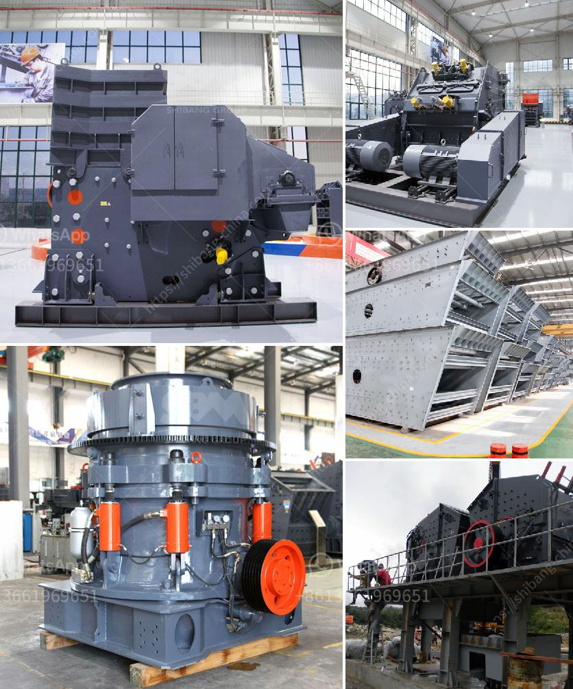

<h3>kaolin mining processing indonesia</h3>
Kaolin, also known as China clay, is a white, soft clay mineral that is mainly composed of the mineral kaolinite. Kaolin is widely used in various industries such as paper, ceramics, rubber, paints, plastics, and many more. It is primarily used as a filler material in the production of paper and as a coating agent in the production of ceramics.

Indonesia is one of the largest producers and consumers of kaolin in the world. The country has abundant reserves of this mineral, especially in the Bangka-Belitung Islands, West Kalimantan, and East Java. The kaolin deposits in Indonesia are mainly formed from the weathering of feldspar-rich rocks.

The process of kaolin mining involves the removal of overlying layers of soil and rocks to expose the kaolin deposit. Once the ore is extracted, it is transported to a processing plant, where it is crushed and refined to remove impurities and improve the brightness and consistency of the material. The processing of kaolin involves several stages, including grinding, drying, bleaching, and classifying.

In the grinding stage, the kaolin ore is ground into a fine powder using crushers and ball mills. The crushed kaolin is then mixed with water and undergoes a classification process to remove any coarse particles. The finely ground kaolin is then sent to a drying facility, where it is dried at high temperatures to reduce moisture content.

After drying, the kaolin undergoes a bleaching process to remove any impurities and improve its color. This process involves the addition of chemicals such as hydrogen peroxide or sodium dithionite, which react with the impurities and convert them into soluble compounds that can be easily washed away. The bleaching process also helps to improve the brightness and whiteness of the kaolin.

Once the bleaching process is complete, the kaolin undergoes a final classification to remove any remaining impurities. The classified kaolin is then packaged and shipped to various industries for further processing and utilization.

Kaolin mining and processing in Indonesia have significant economic and environmental impacts. The mining activities can generate employment opportunities and contribute to the local economy. However, they can also result in the disruption of ecosystems and loss of biodiversity if not managed properly.

To mitigate the environmental impacts of kaolin mining, various measures can be implemented. These include the proper rehabilitation of mined-out areas, the use of environmentally friendly extraction and processing technologies, and the implementation of strict environmental regulations.

In conclusion, kaolin mining and processing in Indonesia play a crucial role in various industries and contribute to the country's economic development. However, it is essential to ensure that these activities are carried out in an environmentally sustainable manner to protect the natural resources and ecosystems. By implementing effective environmental management practices, Indonesia can continue to harness the benefits of kaolin mining while minimizing its environmental impact.
<h3>Contact us</h3><ul><li><strong>Whatsapp:&nbsp;<a href="https://wa.me/8613661969651">+8613661969651</a></strong></li><li><a href="https://swt.shibang-china.com/?git&amp;zhl&amp;kaolin mining processing indonesia"><strong>Online Service(chat now)</strong></a></li></ul><h3>Related</h3><ul><li><a href='portable copper ore processing machines in usa.md'>portable copper ore processing machines in usa</a></li><li><a href='cost analysis of running a crusher plant.md'>cost analysis of running a crusher plant</a></li><li><a href='gypsum processing plant for sale.md'>gypsum processing plant for sale</a></li><li><a href='mobile crushers on tracks.md'>mobile crushers on tracks</a></li><li><a href='copper leaching plants for sale.md'>copper leaching plants for sale</a></li></ul>