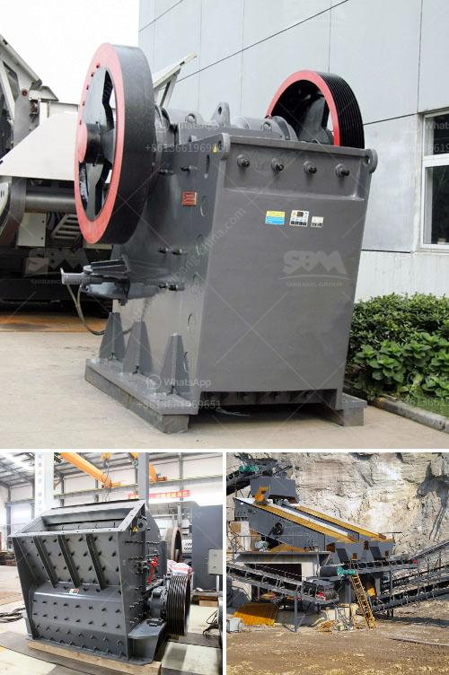

<h3>kaolin processing line</h3>
Kaolin, also known as china clay, is a white, soft, and earthy mineral that is widely used in various industries such as paper, ceramics, rubber, paint, and cosmetics. It is a naturally occurring material, forming from the weathering of aluminum silicate rocks.

The processing of kaolin begins with the extraction of the raw ore from underground mines or open pits. The ore is then crushed and sized to the proper particles using various crushers and vibrating screens. Afterward, the ore is ground to fine particles in a pulverizer or mill.

The ground kaolin particles are then pumped into large settling tanks, where the water and impurities settle to the bottom. This process is known as delamination and dewatering. The purified slurry is then treated with chemicals to remove any remaining impurities and improve the brightness and whiteness of the kaolin.

The next step in the processing line involves drying the kaolin in a rotary kiln, a heated chamber where the moisture content is reduced to approximately 6%. This drying process may take several hours, depending on the moisture content of the kaolin.

Once dried, the kaolin is passed through a series of magnetic separators to remove any iron-bearing minerals. This step ensures that the final product is of high purity and suitable for various applications.

The final stage in the kaolin processing line is the packaging process. Large bags or containers are filled with the processed kaolin and labeled for storage or transportation. The packaging process also involves quality control measures to ensure that the product meets the specified standards.

Apart from the traditional kaolin processing methods, advanced technologies such as flotation, bleaching, and sedimentation have been developed to enhance the quality and efficiency of kaolin production. These methods provide better control over the particle size distribution, brightness, and viscosity of the final product.

The demand for kaolin continues to rise, driven by its wide range of applications. In the paper industry, kaolin is used as a filler and coating material to enhance the smoothness, opacity, and printing properties of paper. In the ceramics industry, kaolin is used to produce fine porcelain and stoneware, providing strength and whiteness to the final product.

Kaolin is also used in the rubber industry to improve the mechanical properties and processability of rubber products. In the paint industry, kaolin acts as a pigment extender, enhancing the opacity and coverage of the paint. Furthermore, kaolin is used in the cosmetic industry to produce various skincare and cosmetic products.

In conclusion, the processing of kaolin involves several stages, including extraction, crushing, grinding, delamination, drying, magnetic separation, and packaging. The use of advanced technologies has enabled the production of high-quality kaolin with improved properties. As the demand for kaolin continues to grow, the processing line for kaolin production plays a crucial role in meeting the diverse needs of various industries.
<h3>Contact us</h3><ul><li><strong>Whatsapp:&nbsp;<a href="https://wa.me/8613661969651">+8613661969651</a></strong></li><li><a href="https://swt.shibang-china.com/?git&amp;zhl&amp;kaolin processing line"><strong>Online Service(chat now)</strong></a></li></ul><h3>Related</h3><ul><li><a href='150 tph mobile jaw crusher for sale in malaysia.md'>150 tph mobile jaw crusher for sale in malaysia</a></li><li><a href='kaolin processing line.md'>kaolin processing line</a></li><li><a href='grinding equipment cost estimate.md'>grinding equipment cost estimate</a></li><li><a href='quartz grits plant machinery.md'>quartz grits plant machinery</a></li><li><a href='jaw crusher supply.md'>jaw crusher supply</a></li></ul>