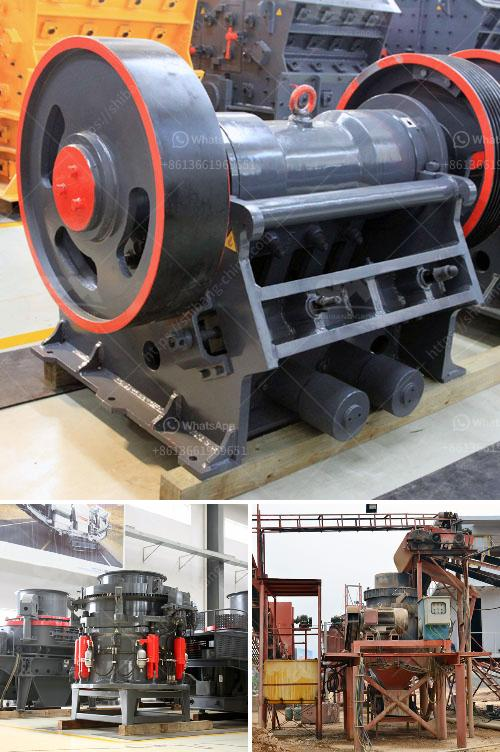

<h3>kenya crusher supplier</h3>
Kenya, known for its vast mining potential, has been attracting investments from both local and international entities. The mining industry in Kenya has experienced substantial growth in recent years, thanks to the country's rich mineral resources. However, the successful extraction of minerals heavily relies on the quality and efficiency of crushing equipment. This is where Kenya's crusher suppliers play a crucial role in revolutionizing the mining industry.

Kenya's crusher suppliers have recognized the increasing demand for high-quality crushing equipment in the mining industry. With a wide range of configurations and models available, these suppliers offer innovative solutions to meet the diverse crushing requirements of mining companies operating in Kenya.

One of the essential factors for Kenya's crusher suppliers is to provide high-quality and reliable crushing equipment. The modern crushers available in the market are designed to handle various types of materials, from hard rocks to abrasive minerals. Furthermore, these suppliers ensure that their machines are durable, capable of withstanding the harsh working conditions encountered in the mining industry.

Crusher suppliers in Kenya understand the importance of incorporating innovative technology into their equipment to enhance efficiency and productivity. Smart features such as automated control systems, remote monitoring, and optimized crushing chambers help mining companies achieve higher throughput and reduce downtime. By focusing on energy efficiency, these crushers not only increase productivity but also minimize environmental impact, aligning with Kenya's commitment to sustainable development.

Kenya's crusher suppliers understand that every mining operation has specific needs. To cater to these unique requirements, these suppliers offer customized solutions. Whether it is a portable jaw crusher, cone crusher, or impact crusher, the crushers can be tailored to match the specific requirements of a mining operation in terms of capacity, feeding size, and final product specifications.

Apart from delivering cutting-edge crushing equipment, Kenya's crusher suppliers provide extensive after-sales support. This includes technical assistance, maintenance training, and the availability of genuine spare parts. The suppliers' commitment to their customers ensures that any issues or concerns are promptly addressed, minimizing downtime and maximizing overall productivity.

Kenya's crusher suppliers have played a significant role in improving the efficiency and productivity of the mining industry. Their ability to offer high-quality, reliable, and customized crushing equipment has revolutionized the way mining companies operate in the country. With their focus on incorporating advanced technology and providing excellent after-sales support, crusher suppliers in Kenya continue to drive the growth of the mining sector. As the demand for minerals in Kenya increases, the collaboration between the mining industry and crusher suppliers is poised to fuel further progress and contribute to the country's economic development.
<h3>Contact us</h3><ul><li><strong>Whatsapp:&nbsp;<a href="https://wa.me/8613661969651">+8613661969651</a></strong></li><li><a href="https://swt.shibang-china.com/?git&amp;zhl&amp;kenya crusher supplier"><strong>Online Service(chat now)</strong></a></li></ul><h3>Related</h3><ul><li><a href='list of stone crusher plant in bangladesh.md'>list of stone crusher plant in bangladesh</a></li><li><a href='station de concassage daun une carriere.md'>station de concassage daun une carriere</a></li><li><a href='what are the prices of crushing equipment.md'>what are the prices of crushing equipment</a></li><li><a href='second hand jaw pulverizer india.md'>second hand jaw pulverizer india</a></li><li><a href='complete stone crushing.md'>complete stone crushing</a></li></ul>