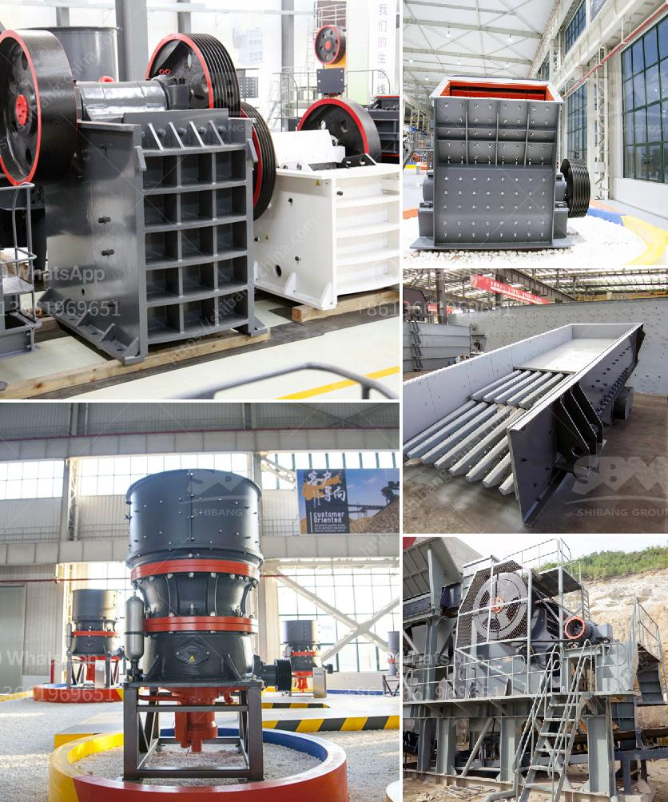

<h3>kenya hammer mill is manufactured</h3>
In recent years, there has been a growing concern about the impact of agricultural waste on the environment and human health. Kenya, a country known for its agricultural productivity, has been exploring innovative solutions to manage this waste effectively. One such solution that has gained significant traction is the Kenya hammer mill.

Manufactured to perfection, the Kenya hammer mill is designed to crush various types of agricultural waste into small particles. With its robust construction and high efficiency, it swiftly transforms waste materials into valuable resources. This not only helps in waste management but also offers several other benefits.

First and foremost, the Kenya hammer mill provides an eco-friendly solution by reducing waste burning. Burning agricultural waste is a common practice in many rural areas, releasing harmful pollutants into the atmosphere. Hammer milling, on the other hand, is a clean and efficient process that eliminates this pollution and helps to mitigate climate change.

Additionally, the crushed agricultural waste obtained from the hammer mill has numerous applications. It can be used as animal feed, providing a rich and nutritious diet to livestock. This ensures that the waste is utilized effectively, contributing to the overall sustainability of the agricultural sector. Furthermore, the crushed agricultural waste can also be used as an organic fertilizer, nourishing the soil and enhancing crop productivity.

Another advantage of the Kenya hammer mill is its affordability and accessibility. Many farmers, both small-scale and large-scale, can easily procure the equipment and incorporate it into their waste management practices. This democratization of the hammer mill technology empowers farmers and leads to widespread adoption, making a significant impact on waste management at the national level.

Moreover, the Kenya hammer mill supports local manufacturing and job creation. The production and distribution of these machines create employment opportunities within the country, stimulating economic growth and development. By promoting the utilization of locally manufactured hammer mills, Kenya is not only taking proactive steps towards waste management but also fostering its own industrial ecosystem.

In conclusion, the Kenya hammer mill is a game-changer in agricultural waste management. By offering an eco-friendly solution, generating valuable resources, and promoting local manufacturing, it has become a powerhouse in transforming waste into wealth. With its numerous benefits, this technology holds immense potential to contribute to Kenya's sustainable development and pave the way for a greener future.
<h3>Contact us</h3><ul><li><strong>Whatsapp:&nbsp;<a href="https://wa.me/8613661969651">+8613661969651</a></strong></li><li><a href="https://swt.shibang-china.com/?git&amp;zhl&amp;kenya hammer mill is manufactured"><strong>Online Service(chat now)</strong></a></li></ul><h3>Related</h3><ul><li><a href='cobalt mobile crusher.md'>cobalt mobile crusher</a></li><li><a href='ball mill made in usa.md'>ball mill made in usa</a></li><li><a href='precipitated calcium carbonate plant in bangladesh.md'>precipitated calcium carbonate plant in bangladesh</a></li><li><a href='conveyor belt for crusher china.md'>conveyor belt for crusher china</a></li><li><a href='vertical shaft crusher.md'>vertical shaft crusher</a></li></ul>