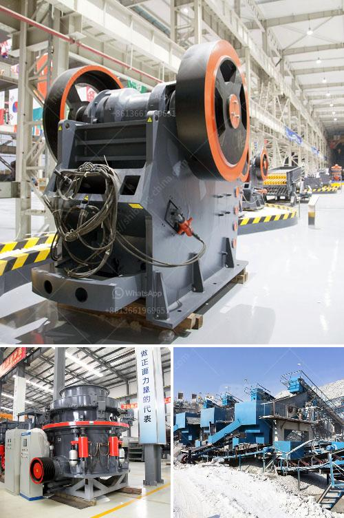

<h3>kenya mobile crusher philippines</h3>
The rapid growth of the construction industry in the Philippines is creating a high demand for mobile crushers. This necessitates the need for reliable and durable equipment to support this thriving sector. One country that has been offering high-quality mobile crushers to this market is Kenya.

Kenya, a country located in East Africa, has been known for its expertise in manufacturing heavy machinery. The Kenyan mobile crusher market is experiencing tremendous growth as a result of the increasing demand for construction materials and the need to meet tight deadlines in the construction industry. This has led to an upsurge in the number of mobile crushers being imported into the Philippines from Kenya.

Mobile crushers are designed to crush stones and rocks of various sizes into gravel, which is essential for various construction projects. These crushers are highly efficient and provide the construction industry with the necessary materials needed for infrastructure development. With the help of mobile crushers, construction projects can be completed faster and at a lower cost, which is crucial in a highly competitive industry.

Kenyan mobile crushers offer several advantages compared to traditional crushers. One significant advantage is their mobility. These crushers can be easily transported from one construction site to another, which saves time and money since there is no need for additional equipment or resources for transportation. This flexibility allows construction companies to efficiently manage their resources and complete projects in a timely manner.

Additionally, Kenyan mobile crushers are known for their durability and reliability. These crushers are built to withstand the harsh conditions of construction sites, ensuring optimal performance even in challenging environments. This makes them ideal for the Philippine market where construction activities often take place in remote areas or areas with limited infrastructure.

Furthermore, Kenyan mobile crushers come in various sizes, allowing construction companies to choose the one that best suits their needs. Whether it's a small-scale project or a large-scale development, there is a mobile crusher available that can efficiently crush stones and rocks to meet construction requirements.

In recent years, Kenya has been supplying the Philippines with mobile crushers that have revolutionized the construction industry. By enabling faster completion of projects and providing high-quality construction materials, Kenya has proven to be a reliable partner for the Philippine construction industry.

In conclusion, Kenya's mobile crushers have played a significant role in transforming the construction industry in the Philippines. These crushers offer mobility, durability, and versatility, making them an attractive choice for construction companies looking to enhance their operations. As the demand for mobile crushers continues to rise in the Philippines, Kenya's expertise in manufacturing reliable and durable equipment will undoubtedly contribute to the rapid growth of the construction industry in the country.
<h3>Contact us</h3><ul><li><strong>Whatsapp:&nbsp;<a href="https://wa.me/8613661969651">+8613661969651</a></strong></li><li><a href="https://swt.shibang-china.com/?git&amp;zhl&amp;kenya mobile crusher philippines"><strong>Online Service(chat now)</strong></a></li></ul><h3>Related</h3><ul><li><a href='iron ore beneficiation flowsheet.md'>iron ore beneficiation flowsheet</a></li><li><a href='mini cement plant in pakistan.md'>mini cement plant in pakistan</a></li><li><a href='sand stone quarry mining.md'>sand stone quarry mining</a></li><li><a href='harga stone crusher kapsitas 20 ton.md'>harga stone crusher kapsitas 20 ton</a></li><li><a href='coal mill grinding media wear rate.md'>coal mill grinding media wear rate</a></li></ul>