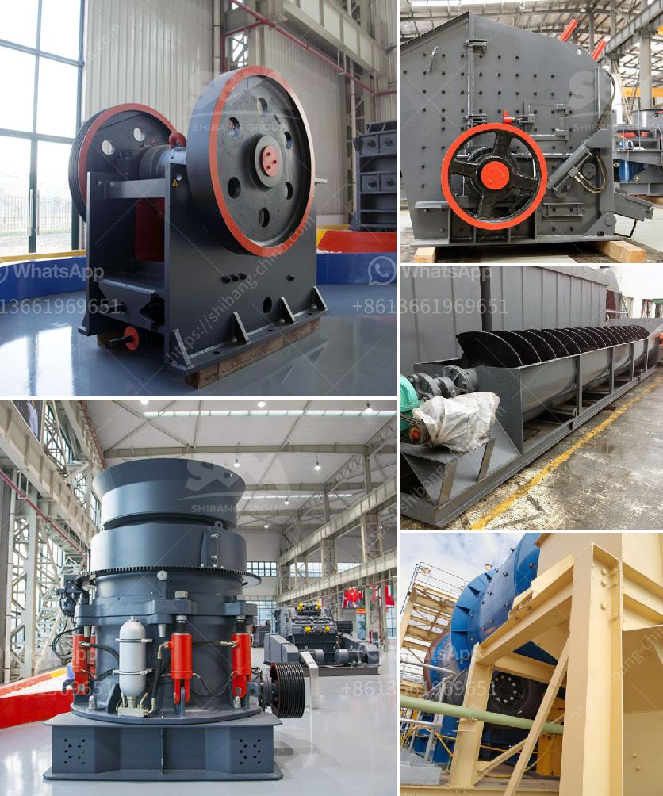

<h3>kenya mobile crusher</h3>
Mobile crusher, also known as mobile crushing plant, is a simple mobile stone production line widely used in railway, highway, construction, water conservancy, metallurgy, etc. Based on the needs of customers, equipped with corresponding crushing equipment, the movable crusher can be divided into mobile jaw crusher, mobile impact crusher, mobile cone crusher, mobile sand crusher, etc.

In Kenya, the infrastructure construction industry is booming and the demand for mobile crushers is skyrocketing. According to the Kenya National Bureau of Statistics (KNBS), the total construction sector contribution to the gross domestic product (GDP) increased from 5.7% in 2014 to 6.3% in 2019. And considering the government's ambitious plan to build one million affordable housing units by 2022, the need for mobile crushers is expected to surge even further.

1. Mobility: Mobile crushers can easily relocate themselves to different job sites, which greatly enhances the flexibility of the equipment. In Kenya, only a few companies are able to transport their crushers to various remote locations, thus they rely on hiring skilled labor and equipment to carry out the crushing work. Mobile crushers, therefore, offer flexibility and convenience to mining companies.

2. Efficient crushing: Mobile crushers enable operations to take full advantage of rocks by providing they are broken down into an acceptable size for crushing. This is done by using various types of machinery, such as jaw crushers, impact crushers, and cone crushers. Mobile crushers impacted drastically on the mining industry, especially in the areas where stationary crushers are not able to reach.

3. Space management is crucial: When you consider the alternative of crushing in a stationary mine, a mobile crusher doesn't require much space. That means you have the advantage of both flexibility and convenience. Mobile crushers are considerably lighter than stationary ones, making them easily transportable.

In conclusion, Kenya's mining industry has a bright future, as the demand for mobile crushers increases in the coming years. As an emerging market, Kenya has vast mineral potential, and the government is actively implementing mining policies to promote the industry. As a result, more and more international companies are investing in mining projects, creating abundant job opportunities and driving economic growth in the country.
<h3>Contact us</h3><ul><li><strong>Whatsapp:&nbsp;<a href="https://wa.me/8613661969651">+8613661969651</a></strong></li><li><a href="https://swt.shibang-china.com/?git&amp;zhl&amp;kenya mobile crusher"><strong>Online Service(chat now)</strong></a></li></ul><h3>Related</h3><ul><li><a href='quartz stone powder manufacturing plant in india.md'>quartz stone powder manufacturing plant in india</a></li><li><a href='artificial marble crusher machinery.md'>artificial marble crusher machinery</a></li><li><a href='mobile crusher 100tph for sale.md'>mobile crusher 100tph for sale</a></li><li><a href='coal screening machine for sale south africa.md'>coal screening machine for sale south africa</a></li><li><a href='quarry machine manufacturers.md'>quarry machine manufacturers</a></li></ul>