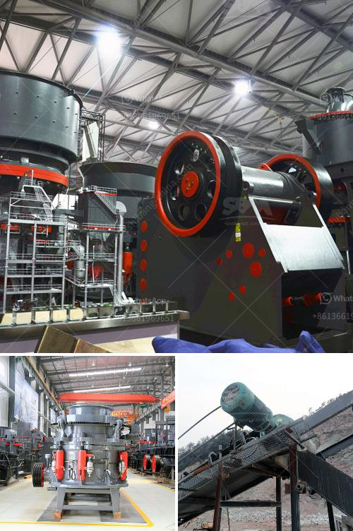

<h3>kenya stone crusher</h3>
Small-scale miners in Africa are facing an unprecedented crisis. With dwindling incomes and limited employment opportunities, many are forced to engage in harmful activities such as illegal mining or stone crushing to make ends meet. However, with the introduction of the Kenya Stone Crusher, these problems have been solved.

Produced by Mwafrika Ballast Crushers, a Kenyan company specializing in small-scale stone crushing, the machine can easily break down both hard and soft rock, producing aggregates for use in road construction and building construction. It is compact, yet powerful, and can be easily transported to different construction sites, making it ideal for small-scale construction projects.

One of the biggest advantages of the Kenya Stone Crusher is that it offers a cost-effective solution for contractors who need to crush large rocks into smaller aggregates. Traditionally, these rocks would have been crushed manually, a time-consuming and labor-intensive task. However, with the Kenya Stone Crusher, this process has been mechanized, saving time and reducing the need for manual labor.

The machine is also environmentally friendly, as it helps to reduce the amount of waste generated during the stone crushing process. Instead of blasting rocks and creating excessive noise and dust, the Kenya Stone Crusher uses manual hydraulics to break down rocks, producing minimal noise and dust emissions. This not only protects the environment but also the health of the workers involved.

Furthermore, the Kenya Stone Crusher is versatile in its application, allowing contractors to produce different sizes of aggregates depending on their specific needs. Whether it is for road base, concrete production, or landscaping, the machine can easily crush rocks to the required size and shape.

In conclusion, the Kenya Stone Crusher not only solves the existing crushing problems faced by small-scale miners but also provides an affordable and environmentally conscious solution for the construction industry. By mechanizing the stone crushing process, the machine has reduced the need for manual labor while still maintaining high productivity levels. It is a valuable addition to Kenya's construction industry and a testament to the ingenuity and innovation of local entrepreneurs.
<h3>Contact us</h3><ul><li><strong>Whatsapp:&nbsp;<a href="https://wa.me/8613661969651">+8613661969651</a></strong></li><li><a href="https://swt.shibang-china.com/?git&amp;zhl&amp;kenya stone crusher"><strong>Online Service(chat now)</strong></a></li></ul><h3>Related</h3><ul><li><a href='gypsum crushing making machine south africa.md'>gypsum crushing making machine south africa</a></li><li><a href='coal screening machine for sale south africa.md'>coal screening machine for sale south africa</a></li><li><a href='second hand crushing and screening plant sale.md'>second hand crushing and screening plant sale</a></li><li><a href='feldspar grinding in raymond mill.md'>feldspar grinding in raymond mill</a></li><li><a href='cost of building a recycling plant in india.md'>cost of building a recycling plant in india</a></li></ul>