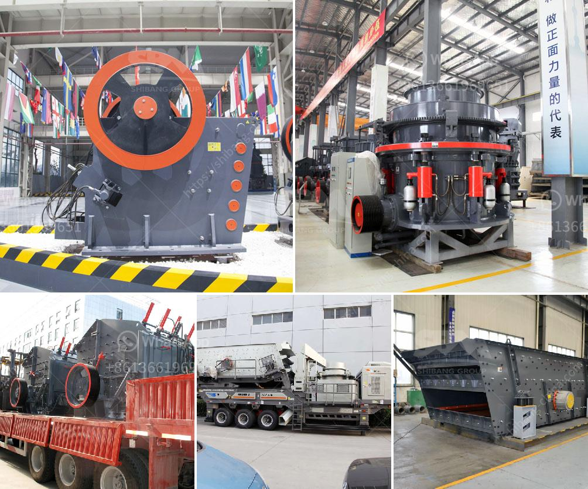

<h3>kobe crushers singapore suppliers</h3>
When it comes to delivering high-quality crushing equipment, Kobe Crushers Singapore Suppliers have established themselves as reliable and reputable suppliers in the market. With their vast range of advanced crushers and exceptional customer service, Kobe Crushers Singapore Suppliers have been meeting the crushing needs of diverse industries, including mining, construction, recycling, and more.

With a history that spans over decades, Kobe Crushers Singapore Suppliers have gained extensive experience and expertise in manufacturing top-notch crushing equipment. They understand the unique requirements of different industries and aim to provide customized solutions that can optimize productivity and efficiency.

One of the key factors that set Kobe Crushers Singapore Suppliers apart is their commitment to using the latest technology in their manufacturing process. By incorporating advanced features and components in their crushers, such as hydraulic systems, heavy-duty drive motors, and high-quality wear parts, they ensure that their equipment delivers outstanding performance and durability.

The range of crushing equipment offered by Kobe Crushers Singapore Suppliers is extensive and covers a wide variety of applications. Their product lineup includes jaw crushers, cone crushers, impact crushers, and gyratory crushers, among others. Each type of crusher is designed to handle different materials and offer specific advantages, depending on the needs of the customer.

One of the standout features of Kobe Crushers Singapore Suppliers is their focus on safety. They understand that safety is crucial in any crushing operation and, therefore, incorporate various safety features in their equipment. These features include advanced control systems, remote monitoring capabilities, and emergency stop functions, ensuring that operators can work safely and efficiently.

In addition to their exceptional product range, Kobe Crushers Singapore Suppliers pride themselves on their outstanding customer service. They have a dedicated team of experienced professionals who are always ready to assist customers in finding the right crushing solution for their specific requirements. Whether it's providing technical support, offering maintenance advice, or ensuring timely delivery of equipment, the customer support team at Kobe Crushers Singapore Suppliers goes the extra mile to ensure customer satisfaction.

Furthermore, Kobe Crushers Singapore Suppliers understand the importance of after-sales service. They offer comprehensive after-sales support, including spare parts supply, equipment servicing, and troubleshooting assistance. By providing these services, they ensure that their customers can maximize the lifespan and performance of their crushing equipment.

In conclusion, Kobe Crushers Singapore Suppliers have proven themselves to be reliable and reputable suppliers in the crushing equipment market. With their focus on advanced technology, safety, and exceptional customer service, they have become a preferred choice for industries seeking top-quality crushing solutions. Their extensive product range, coupled with their commitment to after-sales support, positions them as a dependable partner for any organization's crushing needs.
<h3>Contact us</h3><ul><li><strong>Whatsapp:&nbsp;<a href="https://wa.me/8613661969651">+8613661969651</a></strong></li><li><a href="https://swt.shibang-china.com/?git&amp;zhl&amp;kobe crushers singapore suppliers"><strong>Online Service(chat now)</strong></a></li></ul><h3>Related</h3><ul><li><a href='ball mills for grinding.md'>ball mills for grinding</a></li><li><a href='micro crushers plant.md'>micro crushers plant</a></li><li><a href='ball grinding machine manufacturer in india.md'>ball grinding machine manufacturer in india</a></li><li><a href='coal mill in china.md'>coal mill in china</a></li><li><a href='stone quarrys crusher in ghana.md'>stone quarrys crusher in ghana</a></li></ul>