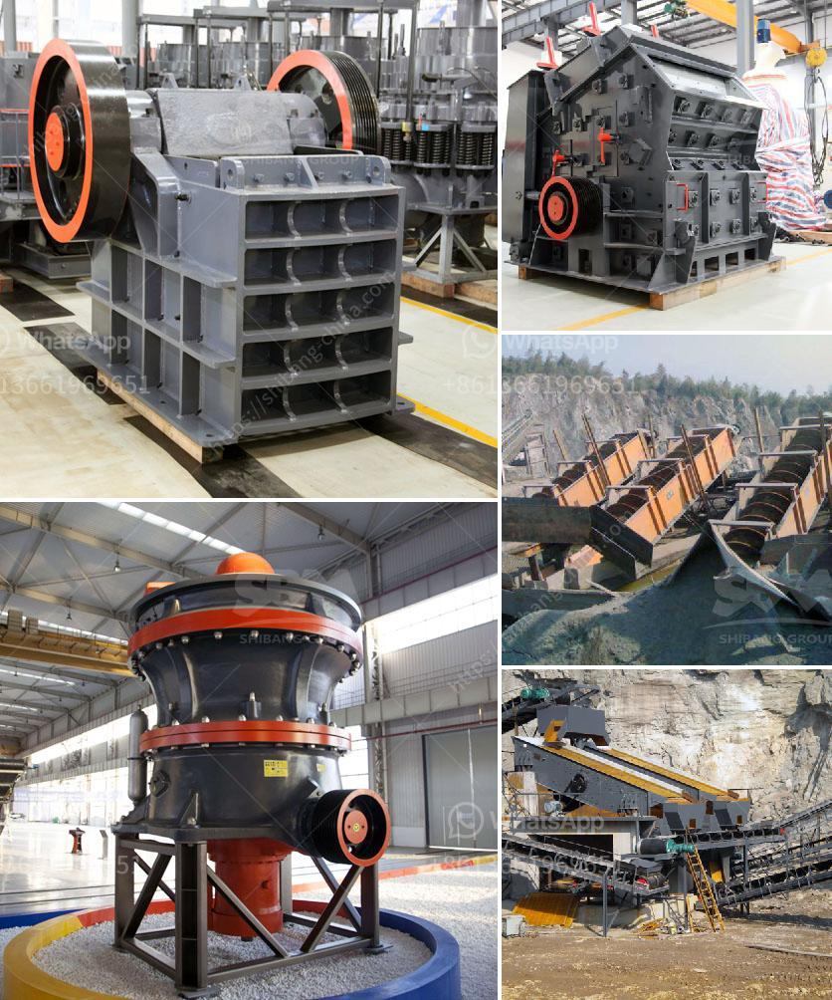

<h3>large capacity sand screening price for sale</h3>
The construction industry heavily relies on high-quality sand to produce sturdy structures and reliable foundations. However, the extraction and procurement of sand can be challenging without the assistance of robust screening equipment. Large capacity sand screening machines are crucial for removing impurities and ensuring consistent sand quality. In recent times, the increasing demand for such equipment has led to a surge in options, making it essential for construction companies to consider various factors, including price, when making purchasing decisions.

One of the primary considerations for construction companies is the price of large capacity sand screening machines. Several factors contribute to the price, such as the machine's capacity, specifications, brand reputation, and durability. Typically, machines with larger capacities come at a higher price point due to their ability to process a substantial amount of sand in a shorter time frame.

Investing in a large capacity sand screening machine offers numerous advantages that directly contribute to improving efficiency and cost-effectiveness for construction projects. Firstly, these machines are designed to handle large volumes of sand, enabling construction crews to process more material in less time. This results in faster project completion, thereby reducing labor costs and increasing overall productivity.

Moreover, large capacity sand screening machines not only remove impurities but also ensure the uniformity and consistency of the sand. This is vital for achieving optimal results in construction projects. By using high-quality sand, the final structure acquires enhanced strength and stability, leading to enhanced durability and reduced long-term maintenance costs.

When considering the price of large capacity sand screening machines, it is essential to evaluate the specifications and features offered by different manufacturers. Some machines may come equipped with advanced technologies, such as adjustable screening angles, multiple screening layers, and automated controls. These features allow for greater flexibility and customization, resulting in improved screening efficiency and accuracy. While such machines may come at a slightly higher price, the long-term benefits outweigh the initial investment. Construction companies can achieve higher screening precision and save costs associated with reworking or rejecting sand due to inadequate quality.

Additionally, durability plays a crucial role in justifying the price of large capacity sand screening machines. Investing in a robust and long-lasting machine reduces maintenance and replacement costs in the long run. It is advisable to opt for machines manufactured by reputable brands with a proven track record of reliability. These machines often come with warranties, ensuring peace of mind for construction companies.

To find the best price for large capacity sand screening machines, construction companies should conduct comprehensive market research. They can compare prices from various suppliers and consider factors like after-sales support, spare part availability, and customer reviews. Reliable suppliers often provide competitive prices without compromising on quality, ensuring a win-win situation for construction companies seeking cost-effective solutions.

In conclusion, large capacity sand screening machines play a pivotal role in ensuring the quality and efficiency of construction projects. Although their prices may vary based on capacity, specifications, and durability, investing in these machines is vital for long-term cost-effectiveness. By choosing wisely and considering reputable suppliers, construction companies can acquire high-quality sand screening machines at competitive prices, resulting in improved productivity, durability, and ultimately, client satisfaction.
<h3>Contact us</h3><ul><li><strong>Whatsapp:&nbsp;<a href="https://wa.me/8613661969651">+8613661969651</a></strong></li><li><a href="https://swt.shibang-china.com/?git&amp;zhl&amp;large capacity sand screening price for sale"><strong>Online Service(chat now)</strong></a></li></ul><h3>Related</h3><ul><li><a href='granite stone crusher india size.md'>granite stone crusher india size</a></li><li><a href='mobile stone crusher plant south africa.md'>mobile stone crusher plant south africa</a></li><li><a href='nigeria crusher plant 200 tph.md'>nigeria crusher plant 200 tph</a></li><li><a href='marble stone milling plant manufacturer.md'>marble stone milling plant manufacturer</a></li><li><a href='silica quartz crusher processing.md'>silica quartz crusher processing</a></li></ul>